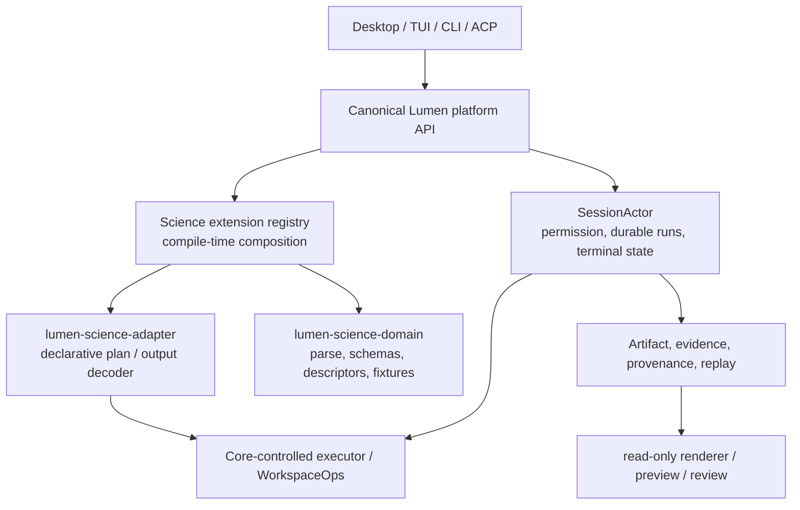

# Lumen Science 极致源码吸收与单 Rust 底座终极执行书

**日期：** 2026-08-01（北京时间）  
**性质：** 重新基线后的长期实施程序；不是完成声明，也不是把上游仓库整体搬进来  
**当前 Science 工作树：** `/Users/lei/code/lumen-science`  
**当前 Science 分支 / HEAD：** `ls5-core-v0.1.251-sync` / `979e2848076ee88b381eb71b3bac42c530701e70`  
**Canonical Lumen：** 独立会话维护；本计划只读取、精确 pin、通过兼容契约协作，绝不覆盖该会话的工作树  

---

## 0. 一页决策

目标不是做九个上游仓库的拼贴版，也不是“把所有 skill 文件显示在 UI 里”。目标是一个可持续升级的 Lumen Science：

```text
唯一 Rust Lumen Core
    └─ SessionActor = permission + execution + terminal state
                     + artifacts + evidence + provenance + replay
          │
          └─ 版本化 Science 扩展契约（不是动态、任意代码插件）
                │
                ├─ 科学领域 schema / parser / descriptor / fixture
                ├─ 受控 adapter（kernel、connector、renderer、model）
                └─ Desktop / CLI / ACP 产品适配层
```

所有上游只可贡献三类东西：

1. **可依法复用的源码与测试向量**：保留 license、copyright、NOTICE、精确 commit 和修改说明；
2. **可独立重建的行为规格**：把输入边界、算法、UX、失败模式写成 Lumen 测试，不引入它的 runtime；
3. **待准入候选信息**：目录、知识、模型、数据或 tool 描述先被 hash-addressed quarantine，不等于可运行。

绝不从上游带入第二个 agent runtime、权限 broker、后台执行器、任意 shell、任意 MCP、任意 URL、可变模型下载器或“成功即完成”的状态机。

### 当前事实与非结论

- `979e284` 已修复上一轮 GitHub 暴露的 Linux-only 测试编译缺陷，并将 `event-listener` 从存在 RustSec 告警的 `5.4.1` 精确升至 `5.4.2`；Supply chain 对该 HEAD 已成功。其他 exact-head CI 仍须以 GitHub 最终结果为准。
- Science 内嵌 Core 仍诚实报告 `0.1.222`。目前受锁约束的比较为 **131 个 shared Rust 文件分叉 + 5 个缺失 = 136**，不是 `v0.1.251` 全量同源。
- 当前 Lumen 和 Science 的 object history 不可直接合并；不可通过 `rebase`、整目录覆盖或“把新 Lumen 复制回来”解决。
- 已有生态目录、Motif algorithms、actor 闭环和 Desktop product proof 都是可保留资产；它们不是废工。但继续在复制的 `SessionCommand` 中加变体，会让后续 Lumen 更新越来越昂贵，必须立即停止这种扩张。

---

## 1. 最终产品与不可谈判的架构规则

### 1.1 用户完整闭环

```text
问题 / 假设
  → ResearchProject
  → 选择已准入 capability（而不是任意技能或脚本）
  → immutable input / plan / environment identification
  → SessionActor durable Begin
  → 人类可理解的 permission
  → actor-controlled execution
  → immutable artifacts + evidence + provenance
  → review / dossier / replay
  → 明确导出或下一步研究决策
```

每次返回给用户的结论都要能回答：谁在何时，用了哪一版数据、模型、二进制、参数、权限决定和输入字节；失败、取消、拒绝和不确定也必须留下可读终态。

### 1.2 七条硬约束

1. `SessionActor` 是唯一 execution / permission / artifact / provenance / replay / completion authority。
2. 任何执行性能力都遵循 `Begin → durable pending approval → Allow-only execute → Finish`；`deny`、`timeout`、`cancel`、解析失败、进程失败均有终态且不得留下成功产物。
3. `owner / project / session / workspace / call / input-digest / operation-id` 必须在 Begin 与 Finish 两端重新绑定；adapter 不可重新打开调用方给的裸路径。
4. Python、Node、Tauri/Electron、MCP、SSH、模型容器、浏览器和外部 CLI 都只是受控 adapter；不得自证完成。
5. 能力目录、上游源码、模型和数据的“已下载”不等于“已准入”。只有达到本文件定义的证据等级才可在产品中标为 runnable。
6. 不复制无许可证、限制性子目录或来源不明文件。对 GPL/专有/未知资料只可按开放标准或公开可观察行为重新实现；不保留、转写或派生受禁文本和资产。
7. canonical Lumen 是唯一 Core 所有者；Science 不再维护第二份可变 `agent/crates` authority implementation。

### 1.3 证据等级

| 等级 | 允许的表述 | 最低证据 |
|---|---|---|
| E0 | 计划 / 候选 | scope、license、威胁和反模式已写清 |
| E1 | 源码存在 | 类型检查、格式化、provenance 完整 |
| E2 | 离线已测 | 正例、拒绝、越权、篡改、取消反例 |
| E3 | actor 闭环 | durable Begin/Finish、permission、artifacts、evidence、replay |
| E4 | 产品路径 | 新建 exact-source binary 经 ACP/CLI 实际运行 |
| E5 | CI | 对同一 commit 的 required GitHub jobs 成功 |
| E6 | 可安装产品 | packaged/bundled engine、headed E2E、clean-machine smoke |
| E7 | 授权 live | 经过用户授权的真实 endpoint/host/device 证据 |
| E8 | 发布 | tag、SBOM、签名、attestation、资产校验 |
| E9 | 运营 | upgrade/rollback、canary、监控、事故演练 |

目录、README、单元测试或模拟不允许跳过 E3/E4/E5 直接宣称“可用能力”。

---

## 2. 重新盘点后的资产地图

### 2.1 当前已有且必须保护的成果

| 资产 | 当前真实位置 | 继续价值 |
|---|---|---|
| durable Science authority | `xai-grok-science` + Science Begin/Finish 路径 | `seq_analyze`、project mutation、kernel admission、workflow、review 等已有反例是未来迁移的 oracle |
| Desktop → Rust 路径 | `packs/science-desktop` 与 Rust ACP | macOS product path 已有真实 CI/本地证明，不应重写成另一桌面 runtime |
| 生态准入 ledger | `docs/science/5.0/ecosystem-admission.lock.json` | 已固定早期上游、nested-license exceptions、704 隔离候选 |
| core drift honesty | `scripts/check-core-drift.py` 与 core admission lock | 防止拿版本号掩盖复制 Core 问题 |
| Motif Rust slices | `xai-grok-science/src/seqbench.rs` | 已有 FASTA、ORF、translation、digest 和 actor-gated artifacts，适合作为第一迁移 pilot |
| knowledge/skill catalogs | `third_party/`、capability registry、Desktop inventory | 保留为 candidate discovery，不升级为自动执行 |

### 2.2 上游源码 intake 总表

所有 pin 必须进入未来 `upstream-lock.json`，并记录 raw `LICENSE` SHA-256、NOTICE、子目录许可、依赖、模型、数据、服务条款和允许/禁止路径。

| 来源与固定 pin | 许可 / 结论 | 极致吸收目标 | 明确不带入 |
|---|---|---|---|
| `snap-stanford/Biomni@400c1f36` | Apache-2.0；数据/工具许可另算 | know-how metadata、tool/resource taxonomy、Eval1 offline benchmark、数据资产分类 | `A1` agent、LangGraph/ReAct、`run_python_repl`/R/Bash、任意 MCP、11GB auto-download |
| `jvogan/motif@e2f3ff69` | MIT；外部 MSA 工具另算 | sequence-review payload limits、artifact export、FASTA/GenBank algorithms、primer/assembly/MSA behavior tests | MCP server、Claude Science config writer、browser workspace、PATH auto-discovery 和未锁定 MAFFT/MUSCLE/Clustal |
| `aipoch/open-science@20f9e235` | Apache-2.0 | connector descriptors、approval UI bridge、provenance read-verify、skill ZIP hardening、operation journal/preview UX | Electron/Node authority、Prisma state、ACP peer runtime、descriptor `run()` escape hatch、arbitrary MCP client |
| `qzzqzzb/OpenClaudeScience@4a5f2ab2` | root MIT，nested mixed | local/SSH path-confinement algorithms、timeout/output limits、desktop navigation hardening、catalog UX | DeepAgents/LangGraph runtime、LocalShell/SSH command authority、arbitrary stdio MCP/env expansion |
| `HUST-NingKang-Lab/BGC-Prophet@de506869` | MIT；weights/ESM/data 未审 | BGC pipeline behavior、FASTA→embedding→detect→cluster→classify stages、result schema | untrusted `torch.load`、network model fetch、user output paths、300GiB LMDB/CUDA pipeline、未审 weights |
| `aurekaresearch/OpenDDE@f607bb3c` | Apache-2.0；weights/data/service 未审 | deterministic inference configuration、staged SHA download semantics、input preprocessing / output lifecycle | `weights_only=False` checkpoint load、public MSA service、host override、PATH binary discovery、CUDA/multinode default |
| `ai4s-research/open-science@f3928bda` | raw root LICENSE 是 MIT；GitHub metadata `NOASSERTION`，须双证据入账 | Rust/Tauri app-private runtime shape、artifact/provenance/runs UI model、preview boundary | OpenCode sidecar、external fetched skills、Anthropic packs、runtime binary/config/profile |
| `exergyleizhou-ux/lumen@2f47a9ad` | 用户控制的 canonical Core；仍在独立会话演进 | stable platform API、SessionActor、permission、workspace execution、release train | 将 Science 的复制 Core 回灌或覆盖独立会话的未提交内容 |
| `exergyleizhou-ux/lumen-science@d5a16642` | 用户控制的 product repo | Science domain、adapters、desktop, tests, provenance | 将历史 Go CLI/MCP 当第二 runtime 或扩大为新 authority |

### 2.3 可直接对照的源码锚点

实施卡必须从这些已验证的路径出发，而不是编造接口：

| 目标 | 参考来源 |
|---|---|
| 现有正确 authority pattern | canonical Lumen `session/handle.rs:204-292` 的 `run_science_csv_with_approval_timeout`；`commands.rs:262-280`；`acp_session_impl/run_loop.rs:623-728` |
| ACP science dispatch | canonical Lumen `agent/mvp_agent/acp_agent.rs:3816-3817`、`extensions/science.rs:109-118` |
| Science 专用扩张事实 | Science `session/commands.rs:195+`、`session/handle.rs:1002+`、`acp_session_impl/run_loop.rs:320-328` |
| Motif bounded payload/artifact | `mcp/motif/payload.ts`、`contracts.ts`、`artifact-export.ts` at pin `e2f3ff69` |
| AIPOCH capability/skill/provenance patterns | `src/main/connectors/{types,registry,service,approval-broker}.ts`、`artifacts/provenance-repository.ts`、`skills/{registry,materializer,github-import,zip-extract}.ts` at pin `20f9e235` |
| BGC deterministic decomposition | `bgc_prophet/command/{extract,predict,output,classify}.py` at pin `de506869` |
| OpenDDE asset/inference boundary | `opendde/utils/download.py`、`runner/{cli,inference,batch_inference}.py` at pin `f607bb3c` |

---

## 3. 单 Rust 底座：目标形态与升级模型

### 3.1 目标形态



**不是动态 Rust plugin ABI。** 第一版使用编译期 composition / versioned crate contract，避免动态库 ABI、任意本机代码加载和不可重放的 extension installation。后续是否支持签名插件另立安全 RFC。

### 3.2 所有权边界

| 位置 | 唯一所有者 | 不得出现 |
|---|---|---|
| canonical Lumen | `SessionActor`、permission、workspace executor、artifact/evidence/provenance/replay、generic extension host | Science 私有 run loop、第二 approval manager |
| `lumen-platform-api`（计划新 crate） | versioned DTO、schema/version negotiation、capability registration contract | `Command`/closure/path handle/secret/任意 bytes executor |
| Science domain | parser、pure algorithms、descriptor、fixture、result schema、license metadata | direct network/process/store root/session mutation |
| Science adapter | descriptor→declarative operation plan、actor output decoding、renderer inputs | own durable run, own permission, raw artifact writes, background spawner |
| Desktop | intent collection、permission UI、read-only presentation | “approve 后自己执行”、writeFile/store access、completion claim |

### 3.3 通用扩展入口 RFC

当前 Lumen **没有**可直接复用的通用 domain-operation registry。因此先在 canonical Lumen 写 RFC 和最小 prototype；以下是所需语义，不是已存在 API 名称。

建议的一个通用 actor command（名称可在 Lumen RFC 中调整）为 `RunDomainOperation(DomainOperationEnvelope)`，而不是继续增加 `BeginScienceX` / `FinishScienceX`。

`DomainOperationEnvelope` 最少要冻结：

- `domain_id`、`operation_kind`、`schema_version`；
- `operation_id`、owner/project/session/workspace/call binding；
- canonical request bytes / SHA-256；
- declared permission subject 与 capability policy revision；
- declared input artifacts 和 allowed output manifest；
- **declarative** command plan（无 closure、无 raw `Command`、无 socket、无 file handle）；
- actor-owned response channel，以及 replay / recovery identity。

Core 负责 durable Begin、approval、execution lease、bounded executor、hash-addressed output、evidence/provenance、replay 和 terminal record。Science 只将输入解析为 schema 并把允许的 plan/result 编解码。

### 3.4 Lumen 持续更新时的升级机制

每次 upstream Lumen 更新不再产生手工 136-file 合并，而是：

```text
canonical Lumen release candidate / immutable commit
  → platform API version + compatibility manifest
  → Science bot 创建 draft pin PR
  → compile + contract tests + actor product tests + Desktop E2E
  → 人工审阅 breaking changes
  → 合入一个 source pin / Cargo.lock 更新
  → rollback = restore prior pin
```

必须新增的计划产物：

- `SOURCE_LOCK.json` 的扩展字段：`lumen_commit`、`platform_api_semver`、`compatibility_manifest_sha256`、release/signature evidence；
- `docs/science/5.0/PLATFORM_COMPATIBILITY.md`：supported / deprecated / removed API；
- `scripts/check-platform-contract.py`：禁止 Science 再依赖 Lumen private `session/*` internals；
- `tests/platform_contract/`：compile fixtures plus allow/deny/cancel/replay compatibility corpus；
- GitHub scheduled **draft-only** update workflow：绝不自动 merge、绝不覆盖 protected Science files。

---

## 4. 分阶段实施程序

每阶段只有在前一阶段 Exit Gate 满足时才进入；可以并行的工作写在“可委派”栏中，但 authority / licensing / final acceptance 永远由 Codex 或明确的人类 reviewer 负责。

### P0 — 关当前门、冻结复制式扩张

**目的：** 把当前 `979e284` 变为 CI 事实，停止继续把 Science 专用变体加进复制 Core。

**实施：**

1. 对 `979e284` 记录 exact-head CI：Desktop CI、CI、Lumen Science CI、Supply chain；Linux workspace test 以 GitHub Ubuntu 为唯一有效证据。
2. 若失败，只修失败日志指向的最小路径；不能借本机 macOS `#[cfg(target_os = "linux")]` 缺失的测试来报绿。
3. 在 Science repo 加入 machine-readable `CORE_EXPANSION_FREEZE` policy：禁止新增 `BeginScience[A-Z]` / `FinishScience[A-Z]` 到复制 Core，除非有已批准的 emergency exception。
4. 清点现有 12 个 Science-only actor variants：`SeqAnalyze`、`SkillQuarantine`、`EvidenceDossier`、`ProjectMutation`、`KernelAdmission`、`WorkflowExecution` 的 Begin/Finish 成对变体。
5. 保持 `0.1.222` 的版本诚实；不因 Lumen 当前会话的新 HEAD 改 VERSION、SBOM 或 release text。

**验收：**

- `git diff --check`；限定 rustfmt；
- GitHub Ubuntu 编译并运行 workspace regression；
- `cargo audit --deny warnings`、Supply chain E5；
- `python3 scripts/release_version.py --root . check`；
- `python3 scripts/check-core-drift.py --self-test`；
- 文档/grep 证明没有新专用 Science actor variant。

**不得做：** bulk sync、rebase/merge Lumen histories、伪造 Linux toolchain、把 CI fail 标记为 flaky 而不复现。

**可委派：** DeepSeek 做 grep inventory 和 evidence table；Grok 做固定清单的 test fixture / docs mechanical edits；Codex 审查 Linux logs、patch 范围和 push。

### P1 — 九源不可变 intake 与许可证/数据总账

**目的：** 把“我看过源码”变成可审计、可重做、可决定的输入，不再靠聊天记忆吸收。

**实施：**

1. 新建 `third_party/upstream-lock.json`（计划文件）：每个 repository 的 URL、branch、SHA、retrieval time、root LICENSE SHA、NOTICE SHA、GitHub metadata、raw-license verdict。
2. 为每个拟吸收 capability 新建 `third_party/provenance/<capability>.md`，字段固定为 source commit/path、reuse mode (`vendor` / `adapt` / `clean-room` / `catalog-only` / `reject`)、license、modification、data/model/external binary terms、Lumen operation id、evidence level。
3. 建 `third_party/forbidden-paths.json`：OpenClaudeScience `skills/{pdf,docx,pptx,xlsx}` 永久 deny；不保留其文本、prompt、script、asset；AI4S external/fetched skills 和 OpenCode binaries 默认 deny；其他 nested licenses 显式列出。
4. 生成 SBOM-like dependency/data/model inventory：BGC checkpoints、ESM weights、OpenDDE checkpoints/CCD/MSA、Biomni datasets/know-how 都必须有独立 disposition。
5. 为所有 upstream source file 做 `license gate` 测试：试图把 denied path 放入 vendor list 必须失败。

**Exit Gate：** 所有九源各有 immutable pin；每个 candidate 有 exactly-one disposition；没有 "unknown but executable"；可验证 license / notice / source hashes 的 offline fixture。

**优先实现顺序：** 先 Biomni、Motif、AIPOCH，然后 BGC/OpenDDE，最后 OCS/AI4S 的少量安全/UX 部分。

### P2 — Canonical Lumen Platform API RFC 与最小 host

**目的：** 先在 Lumen 正确处只加一次通用接缝，再迁 Science；不在 Science copy 中伪造平台 API。

**实施（在 Lumen 独立会话，经其 owner 审核）：**

1. 以 canonical `run_science_csv_with_approval_timeout` 为 reference，写 `DOMAIN_OPERATION_RFC.md`：envelope schema、permission semantics、artifact manifest、recovery/replay、errors、versioning、extension registration lifecycle。
2. 先建 `lumen-platform-api` 最小 crate，只暴露 opaque capability IDs、immutable request/result bytes、declared plan、artifact references 和 typed terminal outcomes。
3. 在 `SessionActor` 添加**一个** generic host route；在不改变现有 CSV/import/fetch/SSH 行为的前提下，将其作为 parallel opt-in。
4. 写 adversarial contract tests：unknown domain、schema downgrade、payload hash swap、wrong owner/project/session/workspace/call、deny/timeout/cancel、duplicate operation、crash/restart、attempted raw spawn。
5. 发布 platform API prerelease / exact commit compatibility manifest；Science 仅通过该 manifest pin，不直接引用 Lumen private session modules。

**Exit Gate：** generic host 与现有 Begin/Finish path 保持相同 terminal semantics；没有让 extension 获得 raw path/process/network access；canonical Lumen exact-head CI + Science contract fixture E5。

**不得做：** dynamic dylib plugin、arbitrary closure callback、JSON RPC 逃生口、让 extension 自己存 terminal state、将所有旧 Science 命令一次性删掉。

### P3 — Science strangler pilot：先迁 `seq_analyze`

**目的：** 用已有安全闭环最强、纯度最高的 `seq_analyze` 做第一条真正的 single-base vertical slice。

**实施：**

1. 从现有 `xai-grok-science/src/seqbench.rs` 提取纯 domain 层：FASTA parse、options schema、analysis result、fixtures；禁止它读取 Session、Store root、permission 或 shell。
2. 新建 Science adapter，将 `SeqAnalyzeRequest` 编译为 generic domain envelope；输入只能是 actor-resolved artifact 或 frozen bytes digest。
3. canonical Lumen host 按 manifest 写 `analysis.json` / `report.md`，记录 Motif pin、license、algorithm revision、input/output SHA 和 environment ID。
4. 让旧 `BeginScienceSeqAnalyze` 仅作为 temporary compatibility façade；结果与新 path byte-for-byte/semantic diff 对比。
5. 删除旧路径前完成: allow, deny, timeout, cancel, stale approval, input swap, caller disconnect, cross-process single-flight, restart replay, direct-write refusal 的 built-binary corpus。

**Exit Gate：** 新 generic path E4/E5；旧 specialized variant 不再是 production route；result schema/provenance parity proved；无新增 Core divergence。

### P4 — 逐族迁移并缩减复制 Core

**目的：** 将过去 12 个专用变体从高风险到低风险收口；每次只迁一族并删相应 private Core touchpoints。

| 顺序 | operation family | 理由 | 必须新增的反例 |
|---:|---|---|---|
| 1 | skill quarantine / attachment import | 文件危险但无外部 process；可先验证 byte/path boundaries | ZIP traversal、symlink、bomb、byte swap、deny 无 candidate |
| 2 | evidence dossier | 只读已成功 artifacts → 新 artifacts | source run substitution、artifact tamper、cross-project read |
| 3 | project mutation / review | durable state / CAS 风险高但无 shell | revision race、retry、owner/project swap、recovery |
| 4 | kernel admission | process identity / protected path | launcher indirection、writable binary、version spoof、post-allow swap |
| 5 | workflow execution | 最后迁；有 spawn / partial output / cancellation | duplicate side effect、child kill/reap、partial rollback、restart |

**每个 family 的机械步骤：**

1. 写 legacy-to-generic behavior matrix；
2. 移 pure schema/fixture 到 domain；
3. 写 adapter plan/result codec；
4. 用 generic host 通过 actor 执行；
5. 新旧双跑的 fixture comparison；
6. 切 ACP/desktop caller；
7. 删除专用 `commands.rs` / `handle.rs` / `run_loop.rs` / `science.rs` 分支；
8. 更新 provenance、contract and product tests；
9. only then reduce drift lock and move source ownership.

**Exit Gate：** `commands.rs`、`handle.rs`、`run_loop.rs`、`acp_session_impl/science.rs` 中 Science-only authority logic 可量化减少；Science 依赖仅 public platform API；copy-core path count 趋向 0，不能只改 drift 数字。

### P5 — 一条可演示、可复现的科研黄金路径

**目的：** 先交付一个真正完整产品，而不是把大量候选 capability 半接入。

**首个场景：** 已注册蛋白/序列输入 → UniProt/已准入离线 evidence → sequence review → 可选 controlled analysis → ResearchProject evidence/claim/review → dossier。

**必须覆盖：**

- project creation / immutable question revision；
- one connector with offline fixture and explicitly pending-live truth；
- import/attachment quarantine then explicit admission；
- generic domain operation approval; deny/timeout/cancel; restart/replay；
- store-owned artifacts / preview; review; dossier；
- exact-source rebuilt binary through ACP；
- macOS Desktop full flow and GitHub CI; no Windows-specific scope required in this phase。

**Exit Gate：** 从空工作区到 dossier 达 E6（packaged product另立 gate）；每个 result 可离线核验；缺网、拒绝、取消、损坏输入不出现成功结论。

### P6 — Capability Wave A：把最强上游价值变为 Lumen 能力

**原则：** 不以“仓库”计数，以达到 E4/E5 的 capability 计数。

| Slice | 主要来源 | 首个 E4 deliverable | 准入边界 |
|---|---|---|---|
| `BiomedicalKnowHowSearch v1` | Biomni | licensed knowledge/query fixture → cited artifact | no automatic data-lake, no generated code execution |
| `CapabilityDescriptor v1` | Biomni + AIPOCH | descriptor registry + policy/risk classifier | descriptor 不含 `run()` 或 executable closure |
| `SequenceReviewArtifact v1` | Motif | bounded HTML/JSON view with build/input hash | renderer no network/no filesystem write/no MCP authority |
| `AttachmentImport v1` | AIPOCH | actor-gated ZIP/.skill quarantine | preview ≠ approve ≠ execute |
| `ConnectorFamily v1` | AIPOCH + existing 40 | one new source with parser/fixture/replay | no live call without E7 authorization |

**Motif next algorithms：** primer/PCR、Gibson、Golden Gate、bounded MSA。每个先 port reference vectors，再加 actor product proof。外部 MSA 只能由 exact pinned binary/container + argv allowlist + immutable scratch + approval 打开。

### P7 — Capability Wave B：BGC 与结构预测必须离线、受控、可追溯

#### `BgcPredict v1`

1. 建 managed model asset registry：publisher, license, SHA-256, size, ESM version, container digest, usage terms。
2. input 仅接受 already-registered FAA/FASTA artifact；所有 scratch 在 run-owned directory；拒绝 caller output path。
3. 分成 embedding / detector / cluster / classifier 四个 durable stages；输出 CSV/JSON + model/environment manifest。
4. `torch.load` checkpoint 仅接受 registry artifact；拒绝用户 checkpoint、network fetch、CUDA default。
5. 初版只 offline CPU fixture；没有预审 weights 则停在 E2，不假装模型已可用。

#### `StructurePredictOffline v1`

1. 初版固定 `use_msa=false`、`use_template=false`、`use_rna_msa=false`；禁止向公共 ColabFold/MMseqs2 发送序列。
2. seed、container digest、checkpoint hash、input JSON、output directory manifest 全部进入 provenance。
3. 预置模型资产先经 source/license/SHA approval；`weights_only=False` 或没有 hash 的路径一律拒绝。
4. 输出必须标为 computation prediction，不得转化为临床、实验或结构事实。

**Exit Gate：** E4 offline product proof + E5; no network/process path outside declared plan; model license/weights provenance 100% complete。

### P8 — Skills、documents、knowledge 与 reviewer 的真产品化

1. 所有 704+ candidates 统一有 `candidate → quarantined → reviewed → approved → deprecated/revoked` 状态机；不能直接从 catalog 变 executable。
2. 每个 approved skill 必有 `CapabilityDescriptor`、license/data/egress/binary declaration、owner、version、negative tests、revocation plan。
3. 文档/Office/PDF 使用 open-standard clean-room converter contract；严禁涉入 OCS 四个 Anthropic restricted skill trees。任何 converter 要有 pinned version/license/NOTICE/no-network/sandbox/hostile-input corpus。
4. reviewer 可提出 verdict 和修订建议，但不能是 completion authority；成功仍由 actor terminal evidence 决定。
5. knowledge ingestion 要与 source/quote/license/record hash 绑定；不可把模型摘要当原始文献证据。

**Exit Gate：** 选定前 20 个高价值 candidate 完成 full disposition；至少 5 个经过 E4/E5，其他保持诚实 quarantine；无“approved but no actor route”。

### P9 — 环境、kernel、remote compute 和可复现性

1. 把 AIPOCH environment discovery / journal / recovery 的 mechanics 置于 actor-driven adapter；不带入 self-provisioning `planStartupAction`、third-party runtime CDN 或 package manager authority。
2. managed runtime registry 记录 interpreter bytes/SHA/version/os/arch/dependency lock/container digest；裸 `python3`/PATH identity 拒绝。
3. package install、SSH/SCP/HPC 都是 `CapabilityDescriptor` + approval + bounded executor；远端 host key、operation hash、timeout, cancel, child reap 必须 durable。
4. operation journal and recovery 下沉到 actor-owned event ledger；恢复不得自动执行 pending approval。

**Exit Gate：** 一个 pinned kernel workflow 从 Begin 到 restart/replay 到 report 全链 E5；没有 global identity、implicit install、unbound remote host 或 partial-output success。

### P10 — Desktop GA（macOS first）

**范围：** 当前用户明确要求 macOS 先行；Windows 只保持非阻塞 cross-compile 信息，不投入专项开发，除非后续授权。

1. Desktop 只启动 source-lock 指定的 canonical Lumen composition binary；检查 binary SHA、platform API version 和 extension manifest。
2. first-run diagnostics 明确显示 engine/version/capability dispositions；找不到受保护 runtime 时 fail closed，不回落到 Homebrew/用户可写 Python。
3. 真 bundled engine、ad-hoc/notarized signing（凭证授权后）、clean macOS install、offline startup、upgrade/rollback 证据逐项建立。
4. Headed E2E 覆盖 project、permission、import, sequence review, artifact preview, denial, recovery；截图和 logs 与 exact release manifest 绑定。

**Exit Gate：** macOS E6 后才可以叫 Desktop beta；E8 前不是 GA。Windows/other platforms 未做时在 UI/release notes 明确说未支持或实验性。

### P11 — Collaboration、remote、Dummy Lab、Digital Twin 与 HIL

这些不是当前软件收口的前置阻塞，但绝不因“AI 科研”而跳过。

1. collaboration 先做 signed/reviewed research package，不做无约束多人写 store；
2. remote compute 必须完成 P9 后才扩展；
3. device path 固定 `Dummy → Digital Twin → HIL → named low-risk pilot`；
4. real-device gate 必有 independent interlock、operator presence、command-plan hash、E-stop、calibration/sensor trust、SOP 和 external safety review；
5. simulation、prediction、HIL 和 real-world outcomes 在 schema/UI/report 中永久区分。

---

## 5. 代理分工：把机械工作压给 DeepSeek / Grok，保留难题给 Codex

### 5.1 Codex 负责且不得外包验收的部分

- single-base architecture、platform contract、authority and security boundary；
- source license / nested license / data/model terms final disposition；
- actor Begin/Finish、permission、artifact, provenance, replay, cancellation；
- threat modeling、adversarial test design、CI failure diagnosis、exact-head acceptance；
- final diff review、commit boundaries、GitHub status interpretation、release claims。

### 5.2 DeepSeek Flash 0731 的高吞吐任务卡

适合：检索、inventory、metadata normalization、fixture extraction、文档表格、grep classification、test matrix generation、JSON schema / descriptor boilerplate。

**硬约束：** 不设计 Core API、不改 `SessionActor`/permission/run-loop、不判断许可证、不运行 live/provider/device、不做 merge/rebase/reset/clean/stash、不写 "passed" 除非原始输出已保存。

示例交接：

```text
任务：为 <repo@sha> 生成 upstream-lock 候选条目。
只读输入：README、LICENSE、NOTICE、package manifests、指定目录树。
输出：JSON 草案 + 每条 source path/sha/license + unknown 字段；不得猜测。
禁止：复制 restricted path、运行源码、修改 Lumen/Lumen Science。
验收：Codex 运行 schema validator、license deny tests、逐条抽样核对。
```

### 5.3 Grok 4.5 的机械实现任务卡

适合：已冻结设计后的 pure parser port、fixture/test translation、descriptor boilerplate、UI list/filter、provenance generator、one-file refactor。

**硬约束：** 每次只改任务卡列出的文件；不自行扩架构；不得引入 `Command::new`、`spawn`、`child_process`、raw store writes、MCP client、HTTP egress；不修改 canonical Lumen；不自动 commit/push 除非任务卡明确授权。

示例交接：

```text
任务：在 <exact paths> 按 <pinned upstream path> 的 reference vectors
实现纯 <algorithm>，不接执行路由。
必须：保留 provenance header；新增正例/边界/反例；跑 rustfmt + 指定 crate test。
不得：加入 actor command、文件写入、网络、shell、任何未列依赖。
交付：git diff、所有命令原始 exit、测试计数、未跑项目。
Codex 验收：独立重跑、检查 license/provenance、决定是否接 actor。
```

### 5.4 每张实施卡的共同格式

1. immutable input: repo / SHA / source paths / docs reference；
2. explicit output paths and permitted files；
3. authority disposition and license disposition；
4. required negative tests；
5. exact commands and expected evidence tier；
6. forbidden actions and non-goals；
7. handoff report: diff, test counts, exits, generated hashes, unrun gates。

没有这七项的“帮我做完”指令一律先退回为不完整实施卡。

---

## 6. 第一批可立即排队的 20 张工作卡

| # | 卡片 | 负责人 | 前置 | 完成定义 |
|---:|---|---|---|---|
| 1 | 记录 `979e284` exact-head CI 结果并分类 | Codex | P0 | CI evidence log，不假绿 |
| 2 | upstream-lock schema + validator | DeepSeek→Codex | P0 | 9 source pins, raw license hashes |
| 3 | forbidden paths / nested license deny tests | Grok→Codex | #2 | restricted path injection fails |
| 4 | capabilities candidate normalization | DeepSeek | #2 | all candidates exact-one disposition |
| 5 | core expansion freeze check | Grok→Codex | P0 | no new specialized variants |
| 6 | DomainOperation RFC | Codex + Lumen session | P0 | approved semantics / no invented API |
| 7 | platform API compile fixture | Codex | #6 | allow/deny/cancel/replay contract |
| 8 | extract seqbench pure domain interfaces | Grok→Codex | #6 | no session/store/process imports |
| 9 | generic seq-analyze adapter | Codex | #7/#8 | actor E3 path |
| 10 | seq legacy/new parity corpus | DeepSeek→Codex | #9 | fixtures/provenance/output parity |
| 11 | remove SeqAnalyze specialized production route | Codex | #10 | no new core drift / E5 |
| 12 | Attachment import threat corpus | DeepSeek | #2 | bomb/traversal/symlink/stale cases |
| 13 | generic skill quarantine migration | Codex | #7/#12 | E4 product proof |
| 14 | Motif SequenceReviewArtifact bounded renderer | Grok→Codex | #9 | HTML/JSON hash, no egress |
| 15 | Biomni KnowHow descriptor import | DeepSeek→Codex | #2 | licensed catalog, E2 only initially |
| 16 | AIPOCH connector descriptor adapter pilot | Grok→Codex | #7 | one offline connector E4 |
| 17 | BGC model asset registry schema | Codex | #2 | refuse unknown checkpoint |
| 18 | OpenDDE offline config contract | Codex | #17 | default rejects MSA/network |
| 19 | macOS source-lock engine launcher check | Grok→Codex | #7 | SHA/API manifest mismatch fails |
| 20 | platform-update draft PR bot design | DeepSeek→Codex | #6 | draft only, no auto merge |

---

## 7. CI、保存与发布纪律

### 每个 PR 的最低门

```text
targeted formatter
→ affected crate / TypeScript check
→ focused positive + negative tests
→ actor product proof when authority changes
→ rebuilt exact-source binary when product route changes
→ git diff --check
→ exact-head GitHub CI
```

authority、runtime、model or adapter changes additionally require supply-chain, provenance and capability admission gates. GitHub success does not prove live provider, packaged installation, release or real hardware.

### 保存规则

- 每个 capability / policy / test fix 一组小 commits；
- 永远 stage explicit paths；不用 `git add -A`；
- 不 reset/clean/stash/rebase/force-push/merge/deploy；
- local gates first, then push the named branch; PR remains draft until scope and evidence are coherent；
- current Lumen worktree is separately protected: no Science task may write there unless an implementation card originates and is accepted in that Lumen session。

### 版本与 release 规则

- `0.1.222` remains the honest Science embedded core version until single-base migration proves source/package/release equivalence;
- no version bump is a substitute for platform contract migration;
- Rust core, legacy Go CLI/MCP, and Desktop have separate truth tables until legacy is formally retired or isolated;
- E8 release requires a clean pin, SBOM, signatures/attestations, binary/artifact digests, clean-machine evidence and rollback plan.

---

## 8. 规模、节奏与成功定义

### 8.1 诚实的时间量级

假设用户、Codex、DeepSeek、Grok 持续协作且上游稳定：

| 目标 | 量级 | 前提 |
|---|---:|---|
| P0/P1 intake + CI closure | 数天到 2 周 | CI queue、license/source data 可取得 |
| P2/P3 platform seam + `seq_analyze` pilot | 2–6 周 | canonical Lumen API owner 同步决策 |
| P4 full de-copy of Science authority paths | 1–3 月 | migration tests keep behavior stable |
| P5/P6 governed research beta | 1–3 月 | limited high-value capabilities, macOS first |
| BGC/OpenDDE offline product slices | 1–3 月 each | model/data license and assets actually admissible |
| Desktop GA / release | 2–6 月 | signing, packaging, clean-machine proof |
| HIL / real device | 外部关键路径 | SOP, hardware, operators, safety review |

这些不是承诺日期；真正限制不是写代码速度，而是 API compatibility、license/data rights、reproducibility、CI、release and safety evidence。

### 8.2 什么才叫“彻底做成”

只有同时满足下列条件，才可称 Lumen Science 软件平台完成一个大版本：

- canonical Lumen is the only Rust Core; Science does not own a mutable authority fork;
- an upstream Lumen update is a pin/compatibility review, not a hundred-file merge;
- at least a focused set of scientific capabilities reaches E6 on macOS, not merely a 704-item catalog;
- every runnable capability has source/license/data/model/runtime provenance and actor-owned completion;
- users can install, recover, replay, review, export and verify a real research dossier;
- release evidence is separate from live endpoint or device claims;
- any future lab/device action is still behind independent human and hardware safety gates.

---

## 9. 本计划替代的错误路线

- **错：** 趁 Lumen 变化把整个 `agent/crates` 再同步一次。  
  **对：** 先形成 stable platform seam，用 one-pin upgrade train 迁移。

- **错：** 704 candidate / 224 Biomni tools / 207 skills 统统变成 runnable。  
  **对：** capability-by-capability admission，风险越高证据越强。

- **错：** 把上游 Python/Node/agent/MCP runtime 原封不动接上来。  
  **对：** 只吸收 algorithms、parsers、descriptors、tests、UX mechanics；execution stays actor-owned。

- **错：** 根 MIT/Apache 等于所有模型、数据、外部 API 和 nested skills 都可复制。  
  **对：** repository code、subdirectory code、weights、datasets、web services、binary dependencies 分别处理。

- **错：** 用大量机械 AI 任务掩盖架构没决定。  
  **对：** Codex 先锁 contract；DeepSeek/Grok 再高吞吐实施；Codex 独立验收。

---

## 10. 下一次开工的精确顺序

1. 等待并记录 `979e284` 的 remaining exact-head CI；若 Linux failure，先以日志修最小 patch。
2. 提交 P1 的 `upstream-lock` / forbidden-paths schema，不改运行时能力。
3. 在 canonical Lumen 的独立会话提出 P2 `DomainOperation` RFC；不要向 Science copy 继续加命令。
4. 只在 RFC 被接受、contract fixture 建立后，启动 `seq_analyze` strangler pilot。
5. Pilot E5 后再发给 Grok/DeepSeek 第 12–20 张机械任务卡。

这样推进，前面已做的 actor、Desktop、Motif、catalog、provenance 成果会被保留并变成测试 oracle；未来 Lumen 更新则被收敛为受控 API compatibility 工作，而不再把整个 Science 项目拖回手工合并地狱。
