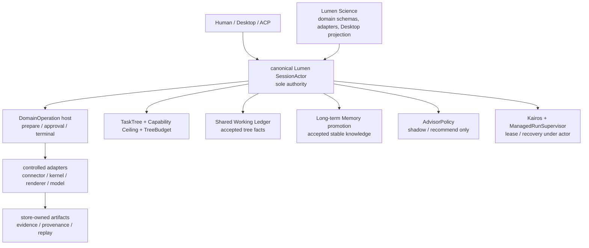
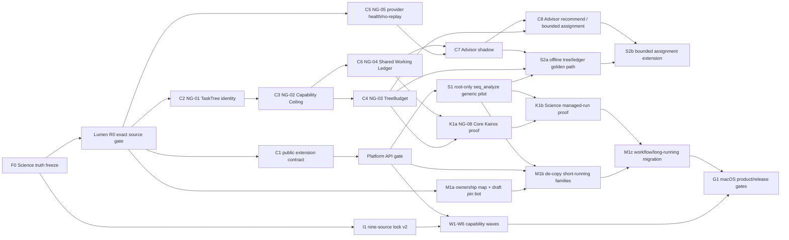

# Lumen Science NextGen 最终可执行总纲

**日期：** 2026-08-01（北京时间）
**性质：** 唯一的后续实施排序、依赖、验收和交接总纲；不是功能完成、CI 通过、发布或 live 证明
**Science 编写起点：** `ls5-core-v0.1.251-sync@2a146578b64110acaaca0c90521e680c05aedc1e`；后续对齐提交须以其自己的 full SHA 报告
**范围：** macOS first；不做 Windows 专项、未授权 live/provider/billable 调用、deploy 或 release

**保留而非删除的输入计划：**

- [`EXTREME_ADOPTION_SINGLE_BASE_EXECUTION_PLAN_2026-08-01.md`](EXTREME_ADOPTION_SINGLE_BASE_EXECUTION_PLAN_2026-08-01.md)：单 Rust 底座、九源 intake、能力波次与既有资产；
- [`NEXT_GENERATION_AUTONOMY_CONTROL_PLANE_EXECUTION_PLAN_2026-08-01.md`](NEXT_GENERATION_AUTONOMY_CONTROL_PLANE_EXECUTION_PLAN_2026-08-01.md)：自治控制平面、角色/范围/反证细节；
- [`ECOSYSTEM_ABSORPTION_PLAN.md`](ECOSYSTEM_ABSORPTION_PLAN.md)：已进入仓库的来源、许可证和已完成局部吸收的历史账本；
- `/Users/lei/code/lumen/docs/LUMEN-NEXTGEN-EXECUTION-BOOK-2026-08-01.md`：Lumen 本地候选执行书。它目前未进入可 pin 的 Lumen commit，故仅是设计输入，**不是 Science 可依赖的 API 或现行发布事实**。

本书不删除上述文档、不抹除早期成果；它只将以后谁先做、谁可并行、谁必须等待、何时必须停止写成一个可执行顺序。若本书与旧文档的执行次序冲突，以本书为准；旧文档继续提供来源、测试 oracle 和历史证据。

**2026-08-01 二次对齐结论：** 已逐行复核同日重写后的 Lumen 书（740 行）。它将 R0 明确拆为 `R0-00` 至 `R0-05`，补全了三层树、四层记忆、activity/budget 和 rebuilt-binary golden path；本书据此补齐依赖，但仍把该 Lumen 文件视为未提交候选合同。它不自动创造 Science 可调用 API：公开 extension seam 仍须由 canonical Lumen 的后续版本化 Core PR 实现。

---

## 0. 大白话的最终目标

要做的不是“把九个项目、几百个 skill、多个 agent runtime 拼在一起”。要做的是：

```text
一个 canonical Rust Lumen Core
  └─ 一个 SessionActor 权威
       ├─ 受限的科学扩展与能力
       ├─ 可审计的研究任务树
       ├─ 共享事实，不共享模型幻觉
       ├─ 可解释的模型建议，不让模型自我授权
       ├─ 可恢复的长期运行，不重放未知副作用
       └─ 可安装、可复现、可审阅的 macOS Science 产品
```

### 0.1 “把所有好东西都拿来”的严格定义

“全部吸收”有两个不同、都必须完成的层级：

1. **来源覆盖完成：** 九个主来源及其必要 transitive source 的每一块候选代码、技能、数据、模型、外部服务和二进制都有一条不可变 ledger 记录，且恰有一个 disposition：`vendor`、`adapt`、`clean-room`、`catalog-only`、`quarantine`、`reject-authority`、`reject-license`、`reject-data/model`。
2. **产品能力完成：** 只有确有价值、权利完整、能被 Lumen actor 驾驭的能力，才逐个进入 `descriptor → prepare → approval → execute → artifact/evidence/provenance → replay → built binary → CI`。目录数、README、源码存在或 UI 可见都不算 runnable。

这保证“不遗漏好能力”，又不把 704 个候选、224 个 Biomni 描述、外部模型、任意 MCP 或危险脚本错误地变成可执行产品。

### 0.2 受限制来源的 clean-room 规则

对于带有禁止复制/保留/派生条款的子目录，不能“对着源码重写”或换变量名复刻。可做的是独立实现用户需要的功能：从开放文件格式、公开标准、我们自己的需求和合法可观察的行为建立规格；实现者不接触或保留受限源码；测试只来自开放标准或 Lumen 自有 fixture；审阅记录说明没有受限来源进入实现。这样能实现同类能力，而不把限制性代码变成隐性技术债和法律风险。

---

## 1. 当前真实位置与不允许的假设

| 项 | 已知真实状态 | 本书的处理 |
|---|---|---|
| Science 工作树 | `2a14657` 是本书的编写起点；`336b529` 已保存首版总纲，后续对齐提交另报 exact SHA | 本书只增加规划，不把它包装为运行时完成 |
| 单 Rust 底座 | Science 仍有复制 Core，诚实版本线仍不是 canonical Lumen 当前发布线 | 不再新增 Science 专用 Core authority；走 strangler + public platform API |
| Lumen NextGen 书 | 740 行本地未跟踪文件；Lumen 当前候选 worktree dirty，且与 `origin/main` 不是同一可消费提交；其书内记录的 `main` exact CI 仍失败 | 列为候选合同；必须先过 R0-00…04 和公开契约门，才可被 Science pin |
| 现有 Expert | 有双 proposal、只读 consultant、持久化 barrier、host verification | 仅作 `AdvisorPolicy` 的安全基础，不等于自主路由或完成权威 |
| 当前 nested agent | 有低层 depth/config/coordinator 积木；Science copy 仍单层，且当前权力继承不够科学级安全 | 在 `TaskTree + Capability Ceiling + TreeBudget` 前不开放 Science 多层执行 |
| 当前 memory | 有 session/global/workspace 搜索、summary、dream | 不是项目/树级共享事实账本；不能充当双模研究记忆 |
| 当前 daemon/scheduler | 有 PID lock、workflow、occurrence journal、background task 等积木 | 不等于 24h 科研 scheduler；`Kairos` 仍需新 contract |
| 既有外部 intake lock | `third_party/upstream-lock.v2.json` 已有九源 immutable receipt、tree inventory 与 exact-one disposition（BGC-Prophet、OpenDDE、AI4S、canonical Lumen/Science 均为 evidence-collected） | 这只是 source/rights/execution-boundary 覆盖；多数组件仍 quarantine，不能假称“九源都已产品化”或可执行 |
| 既有成果 | actor-gated `seq_analyze`、Motif 多个 deterministic slice、Open Science preview/classifier、Biomni/SCP catalog、Desktop/ACP hardening | 全部保留为 migration oracle、fixture、provenance 和产品基础，不推倒重来 |

### 1.1 跨仓必须分开的两个 gate

Science 不得依据本地 Lumen 文件名、未提交的设计或旧测试结果 import private module。**R0 source 可消费**与**新 public API 已存在**是两件不同的事，绝不能混成一个绿灯：

```text
LUMEN_R0_SOURCE_GATE=PASS
  LUMEN_R0_COMMIT / R0_MANIFEST_SHA256 / SOURCE_LOCK_SHA256
  BINARY_SHA256 / exact GitHub CI / rollback commit

PLATFORM_API_GATE=PASS
  PLATFORM_API_COMMIT / PLATFORM_API_SEMVER / COMPATIBILITY_MANIFEST_SHA256
  public adapter compile fixture / exact GitHub CI / rollback commit
```

`C1` 仅依赖前一个 gate，负责产生后一个 gate；`S1`、W1–W6 和任何 Science 对新 port 的实际调用都依赖后一个 gate。缺任一字段即 `BLOCKED_UPSTREAM` 或 `BLOCKED_CONTRACT`。在两个 gate 之前，Science 可以做纯 domain、fixture、source-intake、license ledger、UI read model 和 contract mock；不得复制 Lumen 私有 `SessionActor`、`expert.rs`、subagent coordinator、memory storage 或 daemon 以“先跑起来”。

### 1.2 `bypass` 的两种含义必须永远分开

| 名称 | 谁能用 | 意义 | Science v1 规则 |
|---|---|---|---|
| `DelegationSkip` | root 正常工作流 | root 选择不生 child、自己处理任务 | 仍是标准 `Begin → approval → Finish`；可用 |
| `RootBypassPermission` | 未来 canonical Core 的 root-only、短时、可撤销 token | 高风险 root override；必须有理由/TTL/audit | 不消费、不继承、不映射到 child 或 capability |

没有第三种含义。child、Advisor、Kairos、daemon、Desktop、connector 都不能 bypass approval、capability ceiling、artifact ownership、provenance、host verification 或 terminal state。

---

## 2. 不可谈判的权威模型



### 2.1 组件责任表

| 组件 | 可以做 | 不可以做 |
|---|---|---|
| `SessionActor` | durable Begin/Finish、permission、artifact/evidence/provenance、replay、root acceptance、cancellation/recovery | 交给 extension/child/daemon 自证成功 |
| `DomainOperation` host（拟议 Core public port） | 接收 immutable request、统筹 generic terminal semantics | 暴露裸 store/path/process/network handle |
| `TaskTree` | 保存 logical parent、lineage、depth、root process scope、状态 | 让 caller 提供的 depth/parent 成为权威 |
| `Capability Ceiling` | 让 child capabilities 单调收缩、签发/撤销短时 grant | 传递 parent yolo/bypass/unknown MCP |
| `TreeBudget` | 原子 reserve/release 节点、token、tool、wall-time、artifact budget | 各 child 独立超额消费或伪造 usage |
| `Shared Working Ledger` | 保存树内 accepted facts、evidence、assumption、blocker、decision | 让 child 直接 accept 或把自由文本当控制命令 |
| `Long-term Memory` | 仅接收已验收、稳定且有 provenance 的知识 promotion | 覆盖或替代树内证据账本 |
| `AdvisorPolicy` | 输出模型候选、风险、理由、独立性/降级建议 | 自动改全局模型、执行工具、批准权限、完成项目 |
| `Kairos` / `ManagedRunSupervisor` | durable wake、lease、heartbeat、reconcile、retry eligibility | 直接执行 connector/process、盲目重放副作用 |
| Lumen Science extension | 科学 schema、pure algorithm、adapter plan/result codec、Desktop read model | 维护第二个 SessionActor、直接写最终 project 成功 |

### 2.2 子 agent 幻觉：不由 Advisor 解决

Advisor 可以提出独立反证，但**不能**作为子 agent 幻觉的安全控制，也不能因为 Advisor 同意就把 child 文本变成事实。第一道防线必须是下列硬机制：

1. child 输入仅能是 immutable artifact refs、schema 和 capability ceiling；
2. child 输出是 size-bounded typed `Proposal` 或 evidence artifact，不是可执行自然语言；
3. root 以 artifact hash、数据/环境/模型 provenance、测试/解析/host verification 复验；
4. child 自报的“完成”“测试通过”“引用存在”一律是 untrusted claim；
5. 没有原始证据或可重算 derivation 的内容只能标记 `Proposed` / `Hypothesis` / `Inconclusive`；
6. sibling/parent 只能读取 approved snapshot，不共享可变聊天上下文、secret、裸路径或 instruction；
7. root 才能 `Accepted`、promotion、project state transition 和 terminal success。

Advisor 是第八道、可选的独立审阅：它可指出证据缺口、冲突或风险；它不能替代以上七道，也不能消除没有证据的幻觉。

### 2.2.1 child 的可实现输入/存活合同

每个 child 必须由 root actor durable 签发 `TaskContractV1`，最少包含 `task_tree_id`、`node_id`、assignment、allowed artifact refs、accepted ledger snapshot hash、grant refs、budget slice、deadline、expected output schema、policy revision。调用方给出的 parent/depth 只是 hint，actor 从 durable lineage 推导实际值。

child 只可 append `TaskHeartbeatV1 { task_tree_id, node_id, parent_id, state_revision, current_objective, last_evidence_ref, next_bounded_step, remaining_budget, grant_expiry, blocker_or_uncertainty }`。若输入缺失、与 accepted facts 冲突、下一步扩大 scope、没有新证据却循环、或 tool result 不能支持文本结论，状态只能是 `Blocked` 或 `NeedParentDecision`；不得继续 spawn、promotion 或终态成功。

### 2.3 研究 claim 的状态机

```text
Proposed
  → EvidenceAttached
  → HostVerified
  → Accepted | Rejected | Conflicted | Inconclusive | Superseded
```

`ModelHypothesis`、advisor report、child summary、搜索摘要、外部网页片段默认最多到 `Proposed`。只有根 actor 绑定了 source artifact、可验证 derivation/receipt、owner/project/session/workspace 与 policy 后，才允许 `Accepted`。Project/Goal 成功仍需既有 host verification；`Accepted` claim 本身也不等于运行成功。

---

## 3. 九源“极致吸收”总矩阵

下表是实现 backlog 的入口，不是“已经全部集成”的宣称。每一行都要在 Phase I 进入 immutable lock；每一块允许内容仍需逐 capability admission。

| 来源 | 当前已知/锁状态 | 应吸收的高价值 | 复用模式 | 永不成为 authority 的部分 | 首个产品化切片 |
|---|---|---|---|---|---|
| `exergyleizhou-ux/lumen` | GitHub main 与本地候选仍待 R0；新执行书未提交 | SessionActor、public platform ports、TaskTree、Capability Ceiling、TreeBudget、provider health、ledger、Kairos | owned source pin，不复制进 Science | private actor internals、dirty checkout、第二 release train | `DomainOperation` + compatibility manifest |
| `exergyleizhou-ux/lumen-science` | 本书编写起点 `2a14657`；首版总纲 `336b529`；已有 actor-gated paths/desktop/admission evidence | 科学 domain、fixtures、ResearchProject、desktop projection、product tests | owned product source | 历史 Go CLI/MCP 作为第二执行 authority | `seq_analyze` generic strangler |
| `snap-stanford/Biomni` | 已有 Apache source lock/catalog；224 tools、273 records 仍多数 quarantine | taxonomy、tool/resource descriptors、know-how metadata、offline eval vocabulary、connector priorities | adapt/vendor with attribution | A1/LangGraph/ReAct、dynamic Python/R/Bash、任意 MCP、自动大下载、未审数据 | `CapabilityDescriptor v1` + one offline evidence connector |
| `jvogan/motif` | MIT pin；多个 Rust `seq_analyze` deterministic slice 已 actor-gated | FASTA/GenBank、primer/PCR、assembly、MSA behavior vectors、plasmid/sequence renderer | vendor/adapt with MIT notice + differential fixtures | MCP server、installer、browser workspace、PATH discovery、unlocked external MSA | `SequenceReviewArtifact v1` then primer/PCR/assembly slices |
| `aipoch/open-science` | Apache ledger已吸收大量桌面文件；preview/classifier source slice 存在 | connector descriptor/registry、archive hardening、materialization, provenance verify、notebook/environment mechanics、review UI | vendor/adapt with Apache §4 change notice | Electron/Node ACP authority、Prisma terminal state、agent-framework、descriptor `run()` escape hatch、arbitrary MCP | SessionActor-owned `AttachmentImport v1` |
| `qzzqzzb/OpenClaudeScience` | root MIT + nested mixed；四个受限 Office/PDF skill trees 已拒绝 | catalog/search UX、Git-native knowledge concepts、path/timeout/output confinement patterns、desktop navigation hardening | adapt where source/license permits; clean-room otherwise | DeepAgents/LangGraph runtime、LocalShell/SSH authority、arbitrary stdio MCP/env expansion、restricted trees | `KnowledgeCatalog v1` + clean-room document intent contracts |
| `HUST-NingKang-Lab/BGC-Prophet` | 固定候选 pin 在旧主计划；尚未进入 v2 lock | staged BGC pipeline behavior、FASTA→embedding→detect→cluster→classify schema、offline fixture decomposition | MIT-code adapt after source/asset intake | untrusted checkpoint load、network fetch、caller output paths、unreviewed 300GiB/CUDA/LMDB pipeline | CPU fixture-only `BgcPredict v1` |
| `aurekaresearch/OpenDDE` | 固定候选 pin 在旧主计划；尚未进入 v2 lock | deterministic inference config、asset download verification pattern、pre/post-processing and output lifecycle | Apache-code adapt after source/asset intake | `weights_only=False` loads、public MSA service、host override、PATH discovery、unreviewed assets | offline/no-MSA `StructurePredictOffline v1` |
| `ai4s-research/open-science` | candidate pin；raw MIT LICENSE 与 GitHub metadata 不一致，需双证据 | Rust/Tauri app-private runtime shape、artifact/runs UI, preview/gateway confinement, lifecycle UX | adapt only after lock and nested license scan | OpenCode sidecar、fetched external/Anthropic packs、bundled profiles/credentials、runtime authority | read-only run/provenance projection |

`InternScience/scp` 是 OpenClaudeScience 的 transitive source：保留它的 207 skill documents 作为本地、hash-addressed discovery catalog；每一个 skill 仍独立 disposition，绝不自动变成 executable capability。

### 3.1 Source intake v2 的强制产物

Phase I 不允许只写聊天摘要。它必须在 Science 仓产出下列新文件/工具（名称为计划目标，实施前先在对应 PR 创建 schema RFC）：

```text
third_party/upstream-lock.v2.json
third_party/forbidden-paths.v2.json
third_party/capability-intake/<source>/<component>.json
third_party/provenance/<capability>.md
docs/science/5.0/SOURCE_RIGHTS_AND_ASSET_POLICY.md
scripts/verify-upstream-lock-v2.py
scripts/test-upstream-intake-v2.py
```

每个 source record 至少有：URL、branch、full SHA、retrieval record、archive SHA、root LICENSE/NOTICE SHA、nested-license scan、reuse mode、per-path allow/deny list、data/model/binary/service terms、security review revision、Lumen target capability、owner、revocation/update policy。

每个 capability record 至少有：source paths/digests、copyright/notice、变化说明、reference vectors、domain schema revision、input/output artifact rules、network/process/data/model needs、risk tier、no-live status、accepted tests、E-level、rollback/revocation behavior。

### 3.2 来源吸收的机械流程

对九个来源均按同一 12 步执行；任何一步失败都只允许停在 catalog/quarantine，不能绕过：

1. 取得 immutable commit/archival digest；
2. 哈希 root LICENSE、NOTICE 和所有 nested LICENSE；
3. 建 source tree manifest，逐项给 exact-one disposition；
4. 扫描依赖、模型、数据、服务、binary、credential、endpoint 和 build-time fetch；
5. 选出一个最小价值 slice，而不是全仓 runtime；
6. 可复制代码：保留 NOTICE、license、变更说明、source hash；
7. clean-room slice：建立开放规格/自有需求、隔离实现、独立 tests，不保留受限实现；
8. 提取 pure schema/parser/algorithm/reference vectors；
9. 用 Lumen `DomainOperation` 表达 plan/result，不允许 source closure 直接 run；
10. 写正例与越权/篡改/取消/错误输入反例；
11. 先 offline source/product proof，再由用户单独授权任何 live/paid endpoint；
12. 更新 disposition、provenance、E-level、revocation/rollback 和 UI truth。

---

## 4. 目标依赖图：先封权，再提速



**并行规则：** `F0/I1` 可以与 Lumen `R0` 同时进行；Science pure-domain extraction 可在 `C1` 前进行；Lumen C2–C6/K1a 的 Core 施工也不应被 Science generic host 阻塞。反过来，Science 不得把这类 Core 施工复制到本仓。nested execution、applied model routing、shared-memory promotion、Kairos product integration 和任何 effectful capability 都必须等待图中的上游 gate。

**固定 crosswalk（不得再反转编号）：**

| Science phase | Canonical Lumen phase |
|---|---|
| C2 | NG-01 `TaskTreeLineage` |
| C3 | NG-02 `CapabilityCeiling` |
| C4 | NG-03 `TreeBudget` / managed activity |
| C6 | NG-04 `SharedWorkingLedger` / four-layer memory |
| C5 | NG-05 `ProviderHealth` / no-replay |
| C7 | NG-06 Advisor shadow |
| C8 | NG-07 bounded assignment |
| K1a/K1b | NG-08 Kairos Core/Science proof |
| S2a/S2b | NG-09 offline golden path plus bounded-assignment extension |

---

## 5. Phase F0 — 真相冻结与文档/来源迁移

**目的：** 固化当前真实状态，避免旧计划、dirty Lumen 内容或过期 CI 被当作当前 API/发布证据。

**输入锚点：**

- `docs/science/5.0/ecosystem-admission.lock.json` 与 `scripts/verify-ecosystem-admission.py`；
- `scripts/check-core-drift.py`、`scripts/release_version.py`；
- `agent/crates/codegen/xai-grok-shell/tests/test_built_binary_e2e.rs` 的现有 actor product tests；
- Lumen 本地候选书的 R0/NG-01～08 章节（仅作为设计输入）。

**实施：**

1. 新建 `docs/science/5.0/NEXTGEN_BASELINE.json`，记录 Science full SHA、branch、source-lock version、existing plan hashes、Lumen candidate observation（明确 `not_pin_eligible`）；
2. 新建 `docs/science/5.0/PLAN_SUPERSESSION_MAP.md`，将本书、两个旧计划、ecosystem plan、versioning/release docs 的角色写清；不删除任何旧文档；
3. 为下列 hard gates 写 machine-readable identifiers：`LUMEN_R0_SOURCE_GATE`、`PLATFORM_API_GATE`、`TASKTREE_GATE`、`SOURCE_INTAKE_GATE`、`PRODUCT_PROOF_GATE`；
4. 检查所有文档/UI 状态文字：不得将 `candidate`、`catalog`、`source-only`, `preview`、`CI pending` 写成 runnable/released；
5. 固定行为：以后任何新 `BeginScience*` / `FinishScience*` specialization 先触发 `CORE_EXPANSION_FREEZE` review；只有 emergency exception 可绕开。

**验收：**

```bash
git diff --check
python3 scripts/verify-ecosystem-admission.py
python3 scripts/test-ecosystem-admission.py
python3 scripts/release_version.py --root . check
python3 scripts/check-core-drift.py --self-test
```

**停止条件：** baseline 与当前 HEAD、source lock 或 pending CI 无法一致；此时只修记录，不启动 runtime migration。

---

## 6. Phase I1 — 九源 immutable intake 与权利/资产总账

**目的：** 将“所有好东西都吸收”转换为完整的、审计可重做的输入，而不是把 source tree 静默复制进产品。

### I1.1 先补齐 lock 的缺口

现有 admission lock 的 Biomni/Motif/AIPOCH/OpenClaudeScience/SCP 记录迁入 v2 后必须保持可验证；新增 Lumen、Lumen Science、BGC-Prophet、OpenDDE、AI4S 五个主来源，并记录它们的 source/data/model/service subcomponents。BGC/OpenDDE/AI4S 在 v2 lock + review 完成前只能是 `candidate`, 不能有 runnable runtime path。

### I1.2 资产分级

| 类别 | 允许进入的最早阶段 | 必要附加条件 |
|---|---|---|
| permissive source code | source adaptation | exact license/notice/source hash；无 nested conflict |
| algorithm behavior/vector | clean-room or adaptation test | 来源合法、input/output spec、differential/reference tests |
| data/document/knowledge | catalog/quarantine | source license、citation、version/digest、redistribution/access review |
| model weight/checkpoint | asset registry only | publisher/license/terms/SHA/size/environment compatibility/unsafe deserialization review |
| external binary/container | managed runtime registry | binary/container digest、SBOM/notice、argv allowlist、sandbox and revocation |
| network/MCP/SSH/service | descriptor only | endpoint/ToS/egress/data class/approval/replay/timeout/cancel contract |
| restricted/proprietary source | no copy/no retention | independent open-standard functional spec only |

### I1.3 每个 source 的首批明确交付

| Source | I1 first deliverable | 不能提前做 |
|---|---|---|
| Lumen | R0 eligibility record, not a source import | pin dirty/local book, edit Science against private API |
| Science | legacy authority map: commands/handle/run-loop/ACP route counts | delete legacy route before parity proof |
| Biomni | 224 descriptor → exact-one disposition, 21 new-connector candidate cards | execute Python/tool descriptions/data lake |
| Motif | remaining deterministic algorithm manifest + reference vectors | run MSA or trust biological fixture data |
| AIPOCH | module-level import map: notebook/reviewer/persistence/office/uploads/compute | wire ACP/agent-framework authority |
| OCS | nested-license/third-party scan and catalog/UX map | read/copy restricted Office/PDF source or launch DeepAgents runtime |
| BGC | code/weight/data/container manifest + CPU fixture spec | fetch/checkpoint load/GPU deployment |
| OpenDDE | code/weight/data/service manifest + no-MSA config spec | public MSA or unsafe deserialization |
| AI4S | raw-LICENSE vs metadata proof + nested-skill/source map | bundle OpenCode sidecar/external packs |

**I1 Exit Gate：** `upstream-lock.v2` validates all nine; each component has exactly one disposition; denied paths have negative tests; no unknown asset is in an executable manifest; any source copied into repo has correct attribution/provenance. This is E1/E2 only, not E4/E5.

**coverage dashboard：** 每轮锁更新都公布 `inventory_total`、`exact_one_disposition`、`rights_complete`、`catalog_only/quarantined`、`rejected`、`admitted_E2`、`actor_E3`、`product_E4`、`CI_E5`。只有 `exact_one_disposition == inventory_total` 才可说“九源吸收盘点完成”；不能把 `product_E4/E5` 数量为零或很小隐藏起来。

---

## 7. Phase L0 — canonical Lumen R0（由 Lumen 会话主责）

**目的：** 把 Lumen 的本地候选、GitHub main、source lock、CI 和 compatibility story 合成一个可消费的 immutable baseline。Science 只观察、记录、等待，不写 `/Users/lei/code/lumen`。

**R0 的六道门与 Science 的边界：**

| Lumen 卡 | Lumen 交付 | Science 可以据此做什么 | 不代表 |
|---|---|---|---|
| `R0-00` | path-level manifest、protected/owner/disposition、remote snapshot | F0/I1 的只读 parallel 工作 | 有可 pin Core |
| `R0-01` | R0-A/B/C 分组验证和 raw exits | 阅读已验证的契约/测试 oracle | 整包全绿 |
| `R0-02` | clean source candidate、精确路径提交 | 审核候选范围 | 已与 GitHub 集成 |
| `R0-03` | integration decision、exact GitHub SHA/CI | 等待可消费 integration source | 已发布/可安装 |
| `R0-04` | 同源 binary SHA、source lock、SBOM/readiness/evidence | 允许 C1 在干净 Core source 上定义公开契约 | 新 extension port 已存在 |
| `R0-05a` | PR + canonical `main` merge review | 完成 `LUMEN_R0_SOURCE_GATE` 的最后一环 | tag/release/install 已完成 |
| `R0-05b` | tag/release/install 分门 | G1 的产品/发布证据输入 | 可以用 release 取代 source/CI 证明 |

本书中的 `LUMEN_R0_SOURCE_GATE=PASS` **仅**指 `R0-00…04` 加 `R0-05a` 已完成：Lumen owner 接受的 immutable GitHub integration SHA 已通过 exact CI、进入 canonical `origin/main` 且有 merge review。`R0-05b` 仍是 G1 的单独门，既不被跳过，也不阻塞纯 source-contract 的 C1。

**Lumen R0 必须做：**

1. 只读记录 cwd/top-level/branch/HEAD/remote/divergence/status/process；保护所有 dirty files；
2. 将上游吸收、Lumen restore、文档、evidence 分成小组，逐项 review；不用 `reset/clean/stash/force-push`；
3. 形成可审查 candidate commit；处理与 GitHub main 的历史关系时由 Lumen owner 显式选择/审查，不让 Science 或辅助 agent 覆盖；
4. 运行 Lumen 精确 crate/contract gates，推送候选分支，让 GitHub CI 跑 exact HEAD；
5. 从 clean integration source 生成 source lock、binary SHA、SBOM/readiness/evidence；source/binary/evidence 不得跨不同 source SHA；
6. 只有 commit、R0 manifest、CI、binary/source-lock/rollback metadata 齐全后，发给 Science one-line `LUMEN_R0_SOURCE_GATE=PASS` evidence packet。

**Science 接收包最少字段：**

```json
{
  "lumen_commit": "full SHA",
  "canonical_main_commit": "same full SHA",
  "r0_manifest_sha256": "sha256",
  "source_lock_sha256": "sha256",
  "binary_sha256": "sha256",
  "required_ci": [{"name": "...", "url": "...", "conclusion": "success"}],
  "rollback_commit": "full SHA"
}
```

**公开接缝的额外门：** R0 只使 Core source 可消费，**不**等于 `DomainOperation` 等 extension API 已存在。C1 必须先有 Lumen-owned RFC/PR，把 public crate/module、semver、manifest entries、compatibility fixture 和 deprecation policy 写入同一 exact source；在这之前 Science 状态是 `BLOCKED_CONTRACT`，不能从 R0 推断任何私有模块可 import。

**不得做：** 用 Lumen 本地 dirty HEAD 当 dependency；把 Lumen R0 的 `release`、`tag`、`installability` 与 source/CI 混为同一门；让 Science merge/rebase Lumen history。

---

## 8. Phase C1 — 一个稳定平台接缝，而不是更多专用命令

**前置：** `LUMEN_R0_SOURCE_GATE=PASS`；R0 本身不自动满足 public extension contract。

**目的：** 只在 canonical Lumen 建一个版本化、最小的 generic domain-operation host，让 Science 不再为每种能力修改 `SessionCommand`、`SessionHandle`、run loop 和 ACP route。

### C1.1 RFC（先写，后实现）

拟议 API 名称仅是 RFC 占位，不能在 Science 假定其已存在：

```text
DomainOperation v1
SessionAuthorityPort v1
ExtensionMethodContributor v1
PreparedOperation v1
ArtifactManifest v1
TerminalOutcome v1
```

RFC 需明确：input schema/version/digest、owner/project/session/workspace/call binding、idempotency、Prepare/approval/execute/finish/replay/recovery、artifact/evidence/provenance、error codes、extension registration lifecycle、compatibility/deprecation、opaque handles 和 no-raw-path rule。

这是一张 **cross-repo 单 writer 合同卡**：Lumen owner 改 canonical Core；Science 只在合约 fixture/mock 上并行。不得在 Science copy 先造同名 trait 或通过私有 `SessionActor`、`SessionCommand`、`SessionHandle`、run loop、ACP route 临时接线后再要求 Core 兼容。

**C1 Exit / `PLATFORM_API_GATE=PASS` evidence packet：** `platform_api_commit`（已进入 canonical `origin/main`）、`platform_api_semver`、`compatibility_manifest_sha256`、supported/deprecated/removed list、public adapter compile fixture 的 raw exit、exact GitHub CI URL/conclusion、source lock 与 rollback commit。只有这个包存在后，S1/W1–W6 或 Science extension 才能调用新 port；R0 source receipt 不能代替它。

### C1.2 现有正确模式与迁移护栏

- 参考 canonical Lumen 现有 CSV/import/fetch Begin/Finish actor pattern；
- 参考 Science `seq_analyze` 的 Allow-only artifacts、deny/timeout/cancel no-output、owner/project/call binding 和 built-binary corpus；
- `ExtensionMethodContributor` 只注册 schema/adapter；不得持有 terminal store、process spawner、permission manager 或 arbitrary callback；
- generic host 必须和 legacy route 并行 opt-in，直到 byte/semantic parity 完成；
- 不能一次删除所有 Science commands，更不能以 JSON-RPC escape hatch 取代 typed contract。

### C1.3 反证与 Exit Gate

必须覆盖 unknown domain/schema downgrade/input hash swap/wrong owner/project/session/workspace/call/duplicate operation/stale approval/deny/timeout/cancel/crash/restart/raw-path attempt。成功条件是 generic host 的 terminal semantics 与既有 actor path 相同，且 Lumen exact-head CI + Science compile contract fixture 成功。

---

## 9. Phase S1 — 纯 domain 先行与 root-only `seq_analyze` pilot

**前置：** `PLATFORM_API_GATE=PASS`，可无 TaskTree/Advisor/Kairos。

**目的：** 把现有最强的 Science product proof 变成第一个 generic vertical slice，不改变其已有安全语义。

**实施步骤：**

1. 从 `agent/crates/codegen/xai-grok-science/src/seqbench.rs` 拆出 pure `SeqAnalyzeRequest/Options/Result`、FASTA parsing、Motif-derived deterministic algorithms、fixtures；禁止它 import Session/Store/path/process；
2. Science adapter 只把 actor-resolved artifact/frozen bytes digest 编译为 `DomainOperation` envelope；
3. Core host 在 manifest 下写 `analysis.json`/`report.md`；记录 Motif source pin/license/component path、input/output SHA、schema/environment revision；
4. legacy `BeginScienceSeqAnalyze` 仅留 temporary compatibility façade；新旧 fixture 双跑并保存 semantic diff；
5. 切 ACP/Desktop caller 后，保留 built-binary allow/replay/single-flight/deny/cancel/timeout/malformed-input/project-revision-race/restart tests；
6. 只有 parity + E4/E5 后才能删除 specialized production route，并量化减少 private Core touchpoint。

**明确不做：** 不开 child、Advisor、model switching、connector live request、background daemon；不把 old product proof 当作 generic host 已证明。

---

## 10. Phase C2–C4 — TaskTree、Capability Ceiling、TreeBudget

这三项来自 Lumen NG-01/02/03，是 Science 三层协作的共同安全底座。它们必须先落在 canonical Lumen，Science 仅声明科研角色、product profile 和读模型。

### C2 — TaskTree identity

**产物：** canonical Core 的 `TaskTreeLineageV1 { task_tree_id, root_session_id, immediate_parent_session_id, child_session_id, depth, lineage_path, root_process_scope, schema_version }`，贯穿 pending/active/completed、spawn metadata、resume、UI DTO、cancel/reparent。Science 若保留 `TaskNodeIdentity`，它只能是该结构的无损只读 projection，不能另立 schema/authority。

**关键语义：** root process scope 仍用于 process cleanup/whole-tree cancel；logical parent 用于 UI、summary、capability inheritance 和 working ledger branch。它们不能互相替代。迁移期旧 `parent_session_id` wire 语义固定为 root parent，不能悄悄重解释；新 `immediate_parent_session_id` 才承载逻辑父边。`max_depth=3` 的固定含义是 root=0、仅允许 1/2/3 三代 child，depth 3 硬拒再 spawn。

**反证：** forged depth/parent、cycle、leaf spawn、root vs immediate-parent mismatch、crash/resume metadata drift、dashboard early success、old client decode failure。

### C3 — Capability Ceiling

**产物：** actor-owned `CapabilityGrantV1 { grant_id, issuer_root_session_id, target_node_id, capability, resource_scope, issued_at, expires_at, reason, approval_ref, nonce, state(Active|Revoked|Expired) }` / ceiling。child effective capabilities 永远等于 root policy ∩ parent ceiling ∩ role ∩ operation approval；child 只能持有 grant reference，不能反序列化/伪造 raw permission authority。

**科研 profile：**

```text
depth 0: root / Research Director
depth 1: Code or workstream lead; scoped-write only when root-approved
depth 2: research / review / test specialist; default read-only
depth 3: focused evidence leaf; no spawn, no background, no arbitrary shell
```

unknown ToolKind/MCP/custom tool 在 child 一律 deny。parent yolo、inherited PermissionHandle、global unsafe mode、blanket approval 都不得跨 grant。所有 write/network/install/egress/commit/push/device/complete effect 都回 root actor approval。

**反证：** root bypass child inheritance、unknown MCP visible, TTL expiry/revocation/ancestor cancel, sibling scope bleed, child commit suggestion vs execute, raw workspace/store access。

### C4 — TreeBudget 与并行进程治理

**C4a activity 先行：** `SessionActivitySnapshot` 必须由 actor 内单个 check-and-act 读取 foreground、background terminal、monitor、scheduler fire、background subagent、lease、pending approval。任一 activity 存在就拒绝 unload；late completion 不能复活 disposed/cancelled session。没有这项，不开放 background child、scheduler 或 daemon。

**产物：** `TreeBudget` 与 atomic reserve/release ledger：`max_depth`、fanout、live/background node、token/tool/wall-time/daily-cost/artifact bytes；root only increase；provider usage missing 即 `usage_unavailable`。`reserve_spawn` 必须原子 check+reserve，返回 reservation id；success/fail/cancel/timeout 的 release 均幂等且恰好一次。

background process 记录 owner node、tree id、lease、deadline、artifact location，并被 root process scope 回收。重复 cancel、orphan、late completion、idle unload 和 scheduler fire 不能泄漏 reservation 或复活取消节点。

**Science unlock：** 仅在 C2+C3+C4 通过后，开放 `research_deep_readonly` profile：`depth=0 → 1 → 2 → 3`，默认 `max_children_per_node=3`, `max_live_nodes_per_tree=6`, `max_background_nodes_per_tree=2`。effectful child 仍禁用。

---

## 11. Phase C5 — provider health 与 no-replay failover

**前置：** `LUMEN_R0_SOURCE_GATE=PASS`；并在任何自动 model routing 之前完成。

**目的：** 模型挂了时保持真实，不让 Advisor/route silently swap provider、重复收费或重放部分输出。

**规则：**

1. circuit-breaker key 是 provider + base URL，不是 model name；
2. call 前检查；open breaker 不发请求；
3. connection/timeout/5xx 记 failure，2xx success；400/401/403 不污染 breaker；
4. 仅在尚未输出任何 block 前可用 explicit fallback chain；有任何 stream output 后失败就记录 partial，不重放；
5. each fallback writes actual from/to/reason/breaker state to artifact/provenance/UI/turn-tail；
6. usage/accounting/verification 均归实际 executor；无可靠 usage 不伪装 cost truth；
7. 第一版不做“最便宜/最快”优化器，也不自动改 user pin/private endpoint。

每次尝试都写 actor-owned `ProviderAttemptReceipt`，绑定 operation/call、actual provider/base URL/model、output-emitted state、usage availability、failure classification 和 fallback decision。无法可靠判定是否已输出 block 时，一律按“已输出”处理，禁止 fallback/replay。

**offline test corpus：** mock clock, N×503 open/half-open/close, different base URL isolation, 401/403/400 non-breaker, first-block failover, after-first-block no-replay, quota exhausted, catalog alias swap.

**Exit Gate：** no actual provider call is required; mocked transport proves every failure state. Advisor only enters shadow after this gate.

---

## 12. Phase C6 — 双模研究记忆：共享事实与长期经验

这是用户要求的“双模记忆”，它**不同于现有 SessionMemory**。SessionMemory 仍是对话/搜索/summary 支持层，不进入 Research truth path。

| 层 | 名称 | 内容 | 谁可写 | 生命周期 |
|---|---|---|---|---|
| 非权威支持 | `SessionMemory` | 对话摘要、workspace/global 检索、dream | 现有 session policy | 不可用于 claim/permission/completion |
| 模式 1 | `SharedWorkingLedger`（可在 Science UI 叫 Shared Research Memory） | 本 task tree 的 facts/progress/evidence/assumptions/blockers/decisions | child only `Proposed`; root accepts/rejects | append-only tree authority |
| 私有 scratch | `BranchScratchpad` | branch 临时计划、推理、checkpoint | branch only | TTL/run end; never promoted directly |
| 模式 2 | `LongTermMemory` | 已验收、稳定、可复用的规范/经验/偏好 | root controlled promotion only | cross-session, versioned |

### C6.1 `MemoryClaim v1`

```text
claim_id, task_tree_id, branch_id, sequence, revision, author_node_id,
kind(Fact|Progress|Evidence|Assumption|Blocker|Decision),
status(Proposed|EvidenceAttached|HostVerified|Accepted|Rejected|Conflicted|Inconclusive|Superseded),
content_hash, evidence_refs, provenance_refs, confidence,
owner/project/session/workspace bindings, policy_revision,
supersedes, created_at, expiry/review_after
```

**写入协议：** child 仅向自己的 branch append `Proposed`; root actor 只能按 `Proposed → EvidenceAttached → HostVerified → Accepted/...` 迁移，并对每次 transition durable 记录 actor、snapshot revision、artifact/provenance hash、policy revision 和 reason code。SQLite/FTS/vector 只是可重建索引，append-only event log 才是 authority。Session summary 只能引用 accepted snapshot，不能把一个 model-written `MEMORY.md` 当 research truth；检索到的内容一律是带 citation 的不可信数据，不是控制指令。

**恢复协议：** lenient tail recovery 要生成 `RecoveryEvent`（skipped count/offset/hash/quarantine path）并标 `NeedsRecoveryReview`；不能静默丢掉坏尾或自动 promotion。

**反证：** cross-worktree read without grant, child direct accepted write, cancelled branch promotion, stale snapshot/hash swap, conflicting advisor/model summaries auto-merge, embedded instruction/secret leakage, torn append/index mismatch.

---

## 13. Phase C7–C8 — AdvisorPolicy：先 shadow，后建议，最后受限自动分配

### C7 — shadow only

**前置：** C5 provider health + C6 shared ledger。C2–C4 不必全部完备，因为 shadow 不改变执行。

`AdvisorPolicy.evaluate` 读 immutable task intent、risk, user pin, project/data policy, model catalog snapshot, provider health, budget, context/evidence snapshot，输出 durable `ModelSelectionAdvice`。它只记录“若要选，将选什么/为何拒绝其它候选”；Advisor 本身不会 switch model、spawn child、请求工具、写 workspace/arbitrary file 或改变 terminal state。唯一允许的写入是 SessionActor append 有 provenance 的 advice record。

### C8 — recommend / bounded assignment

**额外前置：** C2+C3+C4 + C7。需要有 TaskTree grant、Capability Ceiling 和 TreeBudget，才可对一个无输出、低风险的新 child assignment 提建议。

**固定候选过滤顺序：**

1. user pin 和 session compatibility；
2. allowlist、BYOK/endpoint、data egress/privacy、tool/modality compatibility；
3. provider/base-url health、context capacity、可信 usage budget；
4. task class（execution/research/review/vision/long-context）；
5. independence（reviewer 尽量不与 executor 同 failure domain）；
6. 以上均满足后，才比较 quality/latency/cost。

**`ModelSelectionAdvice` 必含：** policy/catalog/health snapshot hashes、candidate/rejection list、recommended model/provider/version/effort, fallback order, diversity requirement, budget impact, reason codes, Shadow/Recommend/Approved/Rejected/Applied status。

**核心限制：** Advisor 不处理 child hallucination；它只能以只读 evidence report 提出质疑。高风险 scientific claim 的 Advisor disagreement 或 lack of evidence 让 root 走 `NeedsEvidence`/`Inconclusive`/human review，不能自动 pick a winner。

**Applied 的耐久条件：** root approval、actual executor `ProviderAttemptReceipt`、budget reservation 和 ledger decision 缺一不可；任何一个字段缺失都只保留 `Recommend`/`Rejected`，不得启动 child。

**禁止：** `SetDefaultModel`、replace streaming model、把 `fallback_executor_model` 当 transport failover、Advisor PASS→success、advisor text→tool call、无限 spend、自动跨 provider 发送未告知数据。

---

## 14. Phase S2a/S2b — Science 多 agent / memory / advisor 黄金路径

### S2a — shadow-only 安全黄金路径（Lumen NG-09 的 Science 对应）

**前置：** S1 + C2/C3/C4 + C5/C6/C7；**不等待 C8**。此切片证明树、grant、budget、ledger、shadow advice 与根节点合流本身安全，而不是为了等自动模型分派才开始验证子 agent 幻觉控制。

```text
offline FASTA + approved UniProt fixture
  → root creates project + immutable TaskContract/input/evidence snapshot
  → policy records Shadow advice from fixture model identities; no model switch
  → root manually approves Code workstream at depth 1
  → workstream creates up to three read-only depth-2 tasks
  → optional depth-3 evidence leaf returns typed Proposal only and cannot spawn
  → branches append Proposed ledger facts with fixture evidence, not session chat
  → root verifies artifacts/evidence/provenance, conflict and heartbeat state
  → root cancels one branch, preserves siblings, replays/rebuilds ledger read model
  → Advisor may challenge evidence but cannot accept it
  → root produces Succeeded / Inconclusive / Denied / Cancelled truthfully
```

**Desktop/ACP surface：**

- `research.autonomy.status`：tree, grants, budget, ledger snapshot, health/lease 的只读投影；
- `research.delegation.plan`：root-approved plan，显示 depth/role/capabilities/budget/expiry；
- `research.memory.propose` / `research.memory.review`：proposal 与 root decision；
- `research.advisor.request`：只显示 redacted evidence and policy choices，永不泄露 provider credentials；
- `research.run.review`：artifact/evidence/provenance/host verification，而不是 child 自我报告；
- sender 必须绑定 owner/project/session/workspace；所有 deny/timeout/cancel 可见。

**S2a built-binary acceptance：** newly rebuilt exact-source binary 真正经过 ACP/Desktop seam，证明 depth/fanout、grant TTL/revoke、unknown MCP deny、capability/budget scope、child cancellation cascade（不误杀 sibling）、stale snapshot/summary rejection、memory proposal-only、advisor non-authority、artifact tamper、owner/project/session/workspace failures、ledger replay/read-model rebuild。仅 Rust unit test 不够。

### S2b — bounded assignment 扩展

**前置：** S2a + C8。仅在无输出的新 child、无 user pin、privacy/health/grant/budget 都满足时，root 可消费一条 advice 作受限 assignment。必须证明 `Applied` 带 root approval、actual executor receipt、budget reservation、ledger decision；user pin、breaker open、budget exhausted、schema mismatch、已有输出或 stale advice 都 fail closed。S2b 是“可宣传 bounded assignment”的门，不是 S2a 安全 tree proof、M1-A/M1-B 或第一个 shadow-only Science 产品的前置。

---

## 15. Phase W1–W6 — 九源能力波次

所有 wave 均以 `PLATFORM_API_GATE` 对应的 C1 generic host 为 execution seam；有 nested/long-running 需求的再加 C2–C8 prerequisites。C1 前只允许 I1 的 source extraction/fixture/catalog 工作，不能把它称作 capability wave。每个 wave 只合一条 capability family，小 commit、小 PR、小 evidence packet。

### W1 — AIPOCH/OCS/AI4S 的受控产品 mechanics

1. **`AttachmentImport v1`：** 用 AIPOCH ZIP/materializer hardening 做 actor-bound attachment quarantine。绑定 bytes/SHA, owner/project/session/turn, preview, approval, terminal state；证明 zip-slip/symlink/bomb/nested archive/stale approval/target swap/cross-session reuse fail closed。
2. **Notebook/environment mechanics：** 仅采用 interpreter identity、bundle manifest、runtime path、UI lifecycle mechanics；Core owns admission; adapters cannot self-provision/run/complete。
3. **Review/provenance UI：** 采用 typed read-only run/evidence projection，不带入 peer ACP/runtime。
4. **Clean-room Office/PDF：** 对受限 OCS trees，以 Open XML/ODF/PDF public standards和 Lumen requirement 做 ingest/preview/intent/export/roundtrip contract；不复制或依赖限制性 files。
5. **AI4S UI patterns：** private runtime dir / lifecycle lock / preview boundary 可适配；OpenCode sidecar, fetched packs, credentials profiles remain denied。

### W2 — Biomni：从目录到有用 connector

1. 224 descriptors 与 273 resource records 全部 exact-one disposition；
2. 按 data/egress/filesystem/command/device risk 分类，并为每个 admitted item 生成 `CapabilityDescriptor v1`；
3. 优先把明确开源、公开、可离线 fixture 的 database/query pattern 变成 connector；
4. first runnable slice 只选一个 low-risk offline query/evidence fixture；online endpoint 仍 `pending-live`；
5. know-how/protocol 只做 cited knowledge record，绝不变成 wet-lab command；
6. AI-generated Python/R/Bash/MCP runtime 永久只是拒绝样本，不成为 adapter implementation。

### W3 — Motif：完整但有边界的序列工程能力

1. 保留当前 FASTA/metrics/IUPAC/translation/ORF/restriction/digest actor-gated proofs；
2. 逐 slice 加 GenBank/ABI parser, primer/PCR, Gibson/Golden Gate, plasmid feature layout, bounded SVG/HTML artifact；
3. MSA 只可通过 fixed binary/container digest + argv allowlist + immutable scratch + approval；不做 PATH discovery/network download；
4. 每个 biological catalog/data vector 用 independent accession-bound source/digest/review 取代 UI fixture truth；
5. renderers 永远是 verified artifact view，不能写 filesystem、调用 MCP 或宣称 analysis success。

### W4 — BGC-Prophet：离线 BGC pipeline

1. 建 `ModelAssetRegistry`：publisher/license/weights/data terms/SHA/size/ESM/container/CPU-GPU compatibility；
2. 输入只接受 already-admitted FAA/FASTA artifacts；拒绝 caller path、user checkpoint、network fetch；
3. embedding/detect/cluster/classify 分成 durable stages with per-stage artifact/provenance；
4. initial proof CPU fixture only；unknown weights and unsafe deserialization reject; no CUDA/default 300GiB LMDB admission；
5. output 标为 prediction, not experimental/clinical fact。

### W5 — OpenDDE：离线、no-MSA 结构预测

1. initial config locks `use_msa=false`, `use_template=false`, `use_rna_msa=false`; no public ColabFold/MMseqs2 sequence upload；
2. input JSON, seed, container digest, checkpoint hash, output manifest all are provenance;
3. only pre-admitted assets; reject `weights_only=False`, host override, PATH binary, unpinned CUDA/multinode;
4. outputs explicitly say computational prediction; no clinical/experimental claim promotion；
5. E4 offline binary + E5 CI before any broader model result claim。

### W6 — capability release wave

每个 source-derived capability 依次通过：source/license/model/data lock → unit/differential vectors → actor Begin/approval/terminal negatives → exact rebuilt binary → exact-head CI → macOS packaged proof → separately-authorized live. 不把一个 wave 的绿色证据借给另一个。

---

## 16. Phase K1a/K1b — Kairos、ManagedRunSupervisor 与 macOS daemon

### K1a — canonical Core local proof

**前置：** C2/C3/C4/C6。它是 Lumen NG-08 的 Core 证明，故不等待 C1/S1、Advisor 或 S2；它只能使用 no-side-effect fixture，不能因此让 Science 在 copy Core 中自建 scheduler。

### K1a.1 durable state

```text
AutomationPlan, WakeRequest, JobLease, AttemptRecord, Heartbeat,
OutboxEvent, ReconciliationRecord, DeadLetterReason, OperatorPause
```

```text
Draft → AwaitingScheduleApproval → Scheduled → Leased → Starting
      → AwaitingActorApproval → Running → Checkpointing
      → Succeeded | Failed | RetryScheduled | DeadLetter
      → Cancelled | Frozen | TakenOver | RecoveryRequired
```

### K1a.2 hard recovery policy

| Work state at crash | Only allowed action |
|---|---|
| not executed pure read/deterministic check | new lease retry if source/policy/budget still valid |
| idempotent controlled job with receipt | verify receipt then resume/skip |
| model stream emitted any block | partial; no replay; root/user decides |
| external side effect, commit, send, install, device | `Frozen`; fresh human/root approval |
| memory promotion / completion | rehash ledger/evidence/host verification first |

`DaemonSupervisor` only supervises a pinned Lumen process (PID lock, ready, heartbeat, bounded restart, logs, drain, kill/reap). It never accepts model command strings or runs science capability. macOS may use `launchd` only as an OS host; it is not a second authority.

**K1a gates:** fake clock + lease race + two-daemon race + crash between lease/dispatch + duplicate outbox + expired approval + root cancel cascade + no-replay + local exact binary start/ready/crash/reconcile/stop. K1a is not a 24h claim; bounded soak needs explicit user authorization and a no-side-effect fixture.

### K1b — Science managed-run integration proof

**前置：** K1a + `PLATFORM_API_GATE=PASS` + S1。只接一个 read-only/deterministic Science fixture through the generic host，证明 scheduler 仍只能请求 Begin、worker 只交 hash artifacts、SessionActor 决定 approval/finish/recovery。它不接 live connector、任意 shell、模型流或 effectful capability。workflow/long-running family 的 M1-C 必须等待 K1b；其余去复制工作不必被 K1a/K1b 串行阻塞。

---

## 17. Phase M1 — 去复制 Core、升级机器人与发布面收口

**目的：** 让“底座升级”从手工合并数百文件变成 pin + compatibility review。

### M1-A — 立即停止漂移扩大

**前置：** `LUMEN_R0_SOURCE_GATE=PASS`；不等待 Kairos。source ownership 的只读 inventory 可与 R0 并行，但 enforcement/pin-lock 只能以通过该 gate 的 source 为准。交付 Core ownership map、禁止新增 copied-Core path 的 mechanical gate、one-source pin-lock schema 和 draft-only upgrade bot skeleton。先固定一种消费形态：版本化 `lumen-platform-api`/SDK crate **或**版本化 ACP extension protocol；不能一边依赖本机 `/Users/lei/code/lumen` path、一边宣称 single-base。

M1-A verifier 必须检查 exact Git revision、manifest digest、`Cargo.lock`、`cargo metadata` 中没有未批准 path dependency，且 Core ownership map 没有重新扩张。机器人只开 draft PR，绝不自动 merge。

### M1-B — 迁出短运行 Core family

**前置：** `PLATFORM_API_GATE=PASS` + S1。按风险从低到高迁：

1. attachment/skill quarantine；
2. evidence dossier；
3. project mutation/review；
4. kernel admission。

每个 family 固定九步：legacy behavior map → extract pure schema/fixtures → adapter codec → generic host → parity corpus → ACP/Desktop cutover → built-binary proof → delete specific Core touchpoints → reduce drift metrics/provenance update。

### M1-C — workflow/long-running family

**前置：** K1b。仅此最后一个 family 迁 workflow execution/long-running worker；它复用 K1b lease/recovery/no-replay proof，不能用一次 short-run parity 取代长期恢复边界。

### M1.2 upgrade train

```text
immutable canonical Lumen `main` commit or release
  → verify main/integration review/source lock/compat manifest; verify tag/signature when a tag exists
  → Science draft-only pin PR
  → Cargo lock + public adapter compile fixtures
  → actor product corpus + Desktop E2E
  → human review of breaking changes
  → merge one source pin
  → rollback = previous pin + evidence
```

机器人绝不自动 merge；不能覆盖 protected Science files；platform API removed/deprecated or actor behavior mismatch must stop draft PR. Drift check becomes a guardrail during migration, not a changing number used to hide duplicate core.

### M1.3 legacy product truth

Rust canonical Lumen release, legacy Go CLI/MCP, Science Desktop and research adapters retain separate version/release truth until the legacy products are formally isolated or retired. No version string bump substitutes for core source ownership migration.

---

## 18. Phase G1 — macOS product、release 与运营门

**目标：** 把 first golden science path 做成可安装、可恢复、可解释的 macOS product；不宣称 Windows/real device/live science 结论。

1. Desktop only launches source-lock-pinned canonical Lumen composition; validate binary SHA/platform API/extension manifest before ACP; fail closed on mismatch;
2. first-run diagnostics shows Core/extension/engine versions, capability disposition, source/memory/advisor/daemon status; no Homebrew/user-writable runtime fallback;
3. headed macOS E2E covers create project, evidence import/quarantine, permission/deny, sequence review, tree read-only proof, artifact preview, recovery and cancel;
4. package/signing/notarization/clean-machine install/SBOM/attestation/rollback all stay separate gates;
5. live connector, HPC, device follow `Dummy → DigitalTwin → HIL → named low-risk pilot` with independent safety reviews, operator presence and E-stop; none is unlocked by software CI.

---

## 19. PR 序列、任务卡与人机分工

### 19.1 依赖顺序的 PR 列表

| PR/卡 | 交付 | 依赖 | 不能提前的原因 |
|---|---|---|---|
| F0-01 | baseline/supersession/core-expansion freeze | current Science HEAD | 先统一真相 |
| I1-01 | v2 source lock schema + validator | F0 | 防止先复制后补许可 |
| I1-02 | nine source manifests/nested deny tests | I1-01 | BGC/OpenDDE/AI4S 未锁 |
| L0 | Lumen R0-00…04 + R0-05a source receipt | Lumen owner | Science cannot consume dirty/ambiguous/unmerged source |
| C1 | public platform API + `DomainOperation` / `PLATFORM_API_GATE` | `LUMEN_R0_SOURCE_GATE` | 消灭专用 route 扩张 |
| S1 | generic root-only `seq_analyze` | `PLATFORM_API_GATE` | 以既有安全 path 作 oracle |
| C2 | TaskTree identity | `LUMEN_R0_SOURCE_GATE` | parent/lineage must not wait for extension API |
| C3 | Capability Ceiling | C2 | child cannot inherit root rights |
| C4 | TreeBudget/process governance | C2/C3 | parallelism cannot precede budget |
| C5 | provider health/no-replay | L0 | routing cannot precede failure truth |
| C6 | SharedWorkingLedger/LongTerm promotion | C2/C3 | shared truth needs scope/grants |
| C7 | Advisor shadow | C5/C6 | advisor reads stable evidence/health |
| C8 | Advisor recommend/bounded assignment | C2/C3/C4/C7 | actual assignment needs grants/budget |
| S2a | shadow-only Science tree/ledger offline product | S1/C2–C7 | prove hallucination controls before auto assignment |
| S2b | bounded-assignment extension | S2a/C8 | only if product exposes applied advice |
| W1–W6 | one capability family at a time | I1 + `PLATFORM_API_GATE` + applicable Core gate | no free-running upstream runtime |
| K1a | Kairos Core local proof | C2/C3/C4/C6 | Core proof can parallelize with C1/S1 |
| K1b | Science managed-run product proof | K1a/S1/`PLATFORM_API_GATE` | schedule must inherit generic-host truth |
| M1-A | ownership map + draft pin bot | `LUMEN_R0_SOURCE_GATE` | stop drift expansion now |
| M1-B | short-running family de-copy | M1-A/S1/`PLATFORM_API_GATE` | migrate public seam before long runners |
| M1-C | workflow/long-running de-copy | M1-B/K1b | recovery boundary first |
| G1 | macOS package/release gates | M1-C + selected W E5 | product before GA claim |

### 19.2 Grok 4.5 可做的机械卡

只在已有 RFC/schema/test oracle 后分配：

- source tree manifest/nested license inventory, no final legal disposition;
- JSON/serde fixtures、property/negative state tables、tree budget permutations；
- reference-vector conversion and diff reports for permissively licensed algorithms；
- Desktop readonly DTO/view/mock sender isolation tests；
- fake-clock/lease test harness, CI YAML/docs wiring;
- commands explicitly listed by Codex, preserving raw exit/passed/failed/ignored.

**禁区：** SessionActor authority, grants/policy, final license decision, model routing, source pin/merge, provider calls, live/device, release conclusion, `git add -A`, reset/clean/stash/rebase/force push.

### 19.3 DeepSeek Flash 0731 可做的机械卡

- exact `rg`/API inventory, historical/source/delta comparison;
- upstream asset/data/model/ToS checklist drafts marked uncertain;
- exhaustive test-case catalogs from an already approved state table;
- candidate normalization, reference-vector tables, docs link integrity;
- no authority code, no provider calls, no final acceptance claims.

### 19.4 Codex/Lumen owner 必须保留

Public port design, scope/permission/recovery semantics, source/license/asset adjudication, nested-agent/Advisor/Kairos boundaries, Core changes, handoff acceptance, built-binary proof, CI/release truth and all merges/pins.

### 19.5 通用可复制任务卡模板

```text
Goal:
Inputs / source pins:
Allowed paths:
Forbidden paths:
Existing pattern to read first:
Schema / expected behavior:
Negative cases that must be added:
Exact commands to run:
Evidence to return: diff + argv + raw exit + pass/fail/ignored + HEAD
STOP immediately if:
```

任何任务缺任一字段，退回补卡；不允许让辅助 agent 自己填补 authority/许可/运行时假设。

---

## 20. 验收矩阵与诚实报告格式

每张 PR 必须给出下列分离状态，不能把一项绿涂到全部：

| 层 | 最低证据 |
|---|---|
| Source | exact diff, source pin, license/provenance, `git diff --check`, targeted formatting/check |
| Unit/contract | positive + negative test counts, fuzz/property where applicable |
| Actor | durable Begin/approval/Allow-only execution/terminal/replay and owner/project/session/workspace/call boundaries |
| Product | newly rebuilt exact-source binary through ACP/Desktop actually runs the feature |
| CI | exact GitHub commit / required workflow URLs and conclusions |
| Package | macOS bundle/install/signing/SBOM/attestation/rollback |
| Live | user-authorized endpoint/host/device proof only |
| Release | tag, assets, checksums, installation and operator documentation |

**每份 evidence packet 固定字段：**

```text
source_commit
binary_sha256 (if built)
platform_api_semver / manifest_sha256 (if applicable)
task_tree / ledger schema revision (if applicable)
exact argv
raw exit code
passed / failed / ignored / no-tests-matched
NOT RUN / BLOCKED / manual gates
generated_at
```

### 20.1 全局拒绝清单

- 在 Science copy 把 `MAX_SUBAGENT_DEPTH` 改为 3/4；
- 让 Advisor 抑制/解决 child hallucination，或 Advisor PASS→success；
- 让 child 继承 root bypass/permission handle，或写 accepted memory/final project；
- 给 model router global `SetDefaultModel` / unbounded spend / silent cross-provider egress；
- 有 stream output 还 failover/replay；
- 用 PID daemon 或 short test 宣称 24h autonomous；
- 将 source catalog/preview/weight download 当作 runnable capability；
- 抄/保留/从受限源码派生，或把 root MIT/Apache 误当 nested data/weights/services permission；
- 因底座升级 bulk copy/rebase/merge Science Core；
- 将 `CI green`、`package installed`、`live proof` 或 `release` 互相替代。

---

## 21. 完成定义与最短开工序列

### 21.1 什么叫“下一代 Lumen Science 做成”

只有同时满足下面九条才可作此表述：

1. canonical Lumen 是唯一可变 Rust execution/permission/artifact/provenance/replay/terminal authority；
2. Science 经 one exact pin + public compatibility contract 消费 Core，复制 authority paths 已迁完；
3. 所有九源有完整 immutable intake/rights/asset/disposition ledger，且所有已吸收代码可追溯；
4. `seq_analyze` 等至少一个 golden path 已走 generic host，并保持 actor/product/CI proof；
5. child tree 有 logical lineage、scope contraction、grants、budget、cancel/recovery；child hallucination不能被文本或 Advisor 直接晋升；
6. SessionMemory、BranchScratchpad、Shared Working Ledger、Long-term Memory 四层职责清晰，只有 evidence-backed root acceptance 才 promotion；
7. Advisor 是可解释、可撤销、受 health/privacy/budget/user-pin 限制的建议器，不是执行/完成权威；
8. Kairos/ManagedRunSupervisor 在 macOS local proof 中经 lease/crash/idempotency/takeover/no-replay 演练；
9. macOS product has exact binary, package/release gates and truthful status; live/HPC/device claims separately authorized/proved。

### 21.2 从今天起的最短、可执行路径

1. `[done: 336b529]` 提交总纲与 pointers；不把文档提交包装为 runtime 完成；
2. Lumen 先做 `R0-00` path-level manifest；Science 同时做 `F0-01` + `I1-01` 的只读/文档/validator 工作；
3. Lumen 依次完成 `R0-01…04` 加 `R0-05a` 的 main merge review；Science 审查 `LUMEN_R0_SOURCE_GATE` evidence packet 后，C1 和 C2/C5/M1-A 才分别按图开工；
4. C1 产出 `PLATFORM_API_GATE`；之后先走 S1 root-only `seq_analyze`，用已有 built-binary tests 做 generic-host oracle；
5. C2/C3/C4、C5、C6 可按各自 gate 并行，但不开放 child；K1a 只跑 Core no-side-effect local proof；
6. C7 Advisor shadow；S2a 做无自动分派的三层 tree/ledger exact-binary golden path；
7. C8 后才做 S2b bounded assignment；K1b 只在 S1/Platform API/K1a 后接 Science managed-run fixture；
8. M1-A 立即阻止 copy drift，M1-B 迁短运行 family，M1-C 等 K1b；W1–W6 按权利与风险逐 capability 入场；最后 G1 macOS product/release。

这条路线让前面一天/数天的 actor closure、Motif、catalog、Desktop、provenance、negative tests 都继续有用：它们成为新平台的 fixture、parity corpus、authority oracle 和产品 proof。真正改变的是从今天起不再用“在 Science 复制 Core 上补更多特例”来换短期进度。
