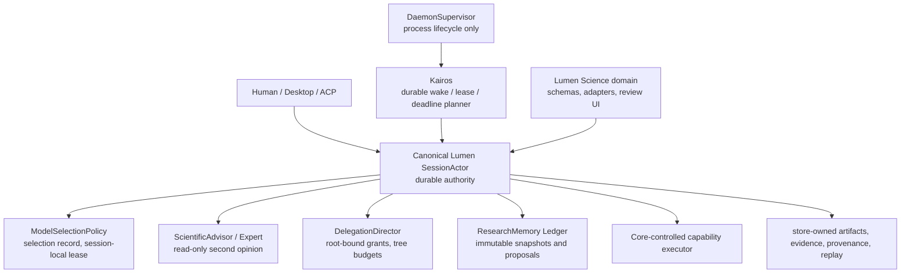
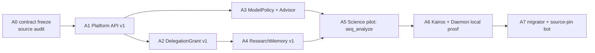

# Lumen Science 下一代自治控制平面终极实施书

**日期：** 2026-08-01（北京时间）
**性质：** 架构与实施契约；不是已完成声明，不授予任何新权限
**扩展的主计划：** [`EXTREME_ADOPTION_SINGLE_BASE_EXECUTION_PLAN_2026-08-01.md`](EXTREME_ADOPTION_SINGLE_BASE_EXECUTION_PLAN_2026-08-01.md)
**Science 证据快照：** `ls5-core-v0.1.251-sync@a93446fc230e54d2e4616c303e89686268ec398d`
**Canonical Lumen 状态：** 另一个工作会话正在设计；本文件只把其建议当作**未合入候选合同**。在其进入一个可复现的 Lumen commit、compatibility manifest 和 CI 前，Science 不得依赖它。
**范围：** macOS first；不在本阶段制作 Windows 产品证明、release、live/provider/billable 调用或自动部署。
**最终执行次序：** [`LUMEN_SCIENCE_NEXTGEN_FINAL_EXECUTION_BOOK_2026-08-01.md`](LUMEN_SCIENCE_NEXTGEN_FINAL_EXECUTION_BOOK_2026-08-01.md) 增加 Lumen R0/NG 依赖、九源 intake 和精确交接顺序；本文件仍是自治语义与反证细节的参考。

---

## 0. 一页结论

需要加强，而且必须加强；但不能把 `Advisor`、模型选择、嵌套 agent、`Kairos`、daemon 和 memory 拼成一套绕过权威的“大自动化”。正确目标是让它们成为 **Lumen `SessionActor` 之上的受限控制平面**：它们提出建议、挑选已授权模型、拆分研究、保留共享证据、安排唤醒和维持受控进程；唯有 Core 能批准、执行、写入最终 artifact、决定完成和恢复。



**不能改变的顺序：** 先让 canonical Lumen 提供稳定、版本化的 authority port，再把 Science 接成消费者；不能先在复制的 Science Core 内部造一个更复杂的自治系统。这样将来 Lumen 升级会变成“更新精确 pin + 跑契约”，而不是重新合并几百个 Rust 文件。

### “三层”和“bypass”的精确定义

这里最容易发生 off-by-one 和安全误解，产品配置必须写死语义：

| 口头说法 | 机器定义 | 正确配置 / 行为 |
|---|---|---|
| “main 是 agent，下面最多三代” | root 是 `depth=0`，允许 child `depth=1 → 2 → 3` | `max_child_depth=3`；`depth=3` 不再有 `task` / spawn tool |
| “main → code agent，code 生 3 个小 agent” | 这是一个深度为 2、扇出为 3 的树，不是三代嵌套 | `max_child_depth=2`、`max_fanout=3` |
| “main → code，然后 code 再连续生三代” | code 已是 `depth=1`，其三代后代到 `depth=4` | 明确配置 `max_child_depth=4`；不得因口语“三层”静默少一层或多一层 |
| “root 直接做，不再往下派” | 可跳过**可选委派**，由 root 直接提交普通 operation | 不创建 child；仍走 Begin → approval → executor → Finish |
| “bypass 底下部分” | **只可表示跳过委派层，绝不表示跳过权限、安全、审计或终态** | 子 agent、Advisor、Kairos、daemon 均不得 bypass `SessionActor`、approval、artifact/provenance 或 sandbox |

`yolo`、父节点复制出的 blanket approval、全局默认模型、未审计 background task、裸路径/裸 store 写入都不是生产级 bypass；它们是必须被消除的越权路径。

---

## 1. 当前真实基础：有积木，不等于已经有下一代自治

以下为本次只读源码核对的事实。它们说明前面的工作没有白做：已有 durable Science authority、Expert / Goal 边界、可配置 nested-agent 底层、session memory 与 workspace daemon。但它们也明确说明新系统还**尚未实现**。

| 面向 | 已验证基础 | 仍缺少，故不得误称“已完成” |
|---|---|---|
| 第二意见 | canonical `session/expert.rs` 已有 `ExpertMode::Dual`、consult budget、auditable state；consultant 是只读、结构化 advisory，且 provider call 前有 persistence barrier | 没有科学任务分类、风险/成本/数据级别驱动的模型路由；没有 Science claim disagreement workflow |
| 完成权威 | Science `session/science_goal.rs` 已规定 consultant `PASS` 仅记录 hash，`host_verify_and_complete` 才能完成 Goal | Advisor 还没有 ResearchProject UI/ACP、prepared review 或 claim/evidence verdict 产品闭环 |
| 模型切换 | canonical Expert 保存原模型，并经 session-local setter 切换/失败恢复；外部切换在 Expert 运行时受限 | 没有 versioned `ModelSelectionPolicy`、可审计 fallback/availability/cost 决策；不得借此改 global default |
| 嵌套 agent | 一份**本地、dirty、不可作 pin 的 canonical Lumen 源码快照**观察到 `[subagents].max_depth`、depth resource、末端移除 task tool、reparent/cancel/orphan 基础 | 当前 Science copy 仍 `MAX_SUBAGENT_DEPTH=1`；未来 canonical HEAD 必须重新审计并写入 contract，且没有 owner/project/session/workspace-bound `DelegationGrant`、树总预算、root-only artifact commit |
| 记忆 | `SessionMemory` 有注入、flush、index、dream、global/workspace/session 检索 | 没有 root/branch-scoped immutable `ResearchMemory`、branch proposal/merge/conflict/provenance 机制 |
| 长驻运行 | `xai-grok-workspace::daemonize` 有 PID lock/takeover；已有 child coordinator 和若干 scheduler 积木 | 没有 actor-owned Research scheduler、wake lease、outbox、reconciliation、root cancel cascade 或 24h 科研运行证明 |
| Kairos / Karios | 本次源码搜索未发现同名生产模块 | 这是新定义的 control-plane 名称，不能假装是已存在的底座功能 |

### 1.1 关键源码锚点（只读证据，不是公开 API 承诺）

- canonical Lumen `agent/crates/codegen/xai-grok-shell/src/session/expert.rs`：单 writer 的 Expert state、`Dual` 仅产生双 proposal、consultant 只读工具 allowlist；
- canonical Lumen `agent/crates/codegen/xai-grok-shell/src/session/acp_session_impl/expert.rs`：先持久化 reservation 再 poll provider、session-local model restore；
- canonical Lumen `agent/crates/codegen/xai-grok-tools/src/implementations/grok_build/task/mod.rs`：可配置 depth gate；
- canonical Lumen `agent/crates/codegen/xai-grok-shell/src/agent/subagent/handle_request.rs` 与 `mvp_agent/subagent_coordinator.rs`：当前 child spawn、permission inheritance、reparent/cancel 的实况；
- Science `agent/crates/codegen/xai-grok-shell/src/session/science_goal.rs`：advisor 不能 approval/transport/Goal completion，host verification 才能完成；
- Science `agent/crates/codegen/xai-grok-shell/src/session/memory_state.rs`：这是 Session 记忆状态，而非分支共享科研记忆；
- Science `agent/crates/codegen/xai-grok-workspace/src/daemonize.rs`：是进程 daemonization/PID lock，不是科研 scheduler。

**重要差异：** 观察到的 canonical nested-agent capability filter 与 depth cap 是有价值的保护，但其 child 仍可能继承 parent permission handle，且没有科学项目范围收缩账本。因此 Science 在 `DelegationGrant v1` 前不得把它暴露为可执行科研树。该观察不是平台保证：每个未来 canonical Lumen HEAD 都要重新审计，并以 exact source pin、contract tests 和 CI 为准。

---

## 2. 目标架构：六个模块，只有一个权威

### 2.1 权限与责任矩阵

| 模块 | 唯一职责 | 可以做 | 绝不能做 |
|---|---|---|---|
| **SessionActor（canonical Core）** | 唯一 execution / permission / terminal authority | durable Begin/Finish、grant、artifact/evidence/provenance、replay、cancel/recovery | 让 extension、Advisor、daemon 或 child 自证成功 |
| **ModelSelectionPolicy** | 从已批准模型池做可解释选择 | 返回 executor/advisor candidates、fallback order、budget/risk reasons | 改全局 default、绕过用户/provider/data policy、直接执行工具 |
| **ScientificAdvisor / Expert** | 第二意见、反证、证据缺口检查 | 只读 evidence、受限 consult、输出 typed verdict/proposal | grant permission、调用副作用工具、完成 Goal/Project、写最终状态 |
| **DelegationDirector** | actor-owned delegation grant、tree ledger、scope contraction | 创建/撤销 child lease、预算、取消 cascade、schema summary | 让 parent 放大 child 权限、共享 raw workspace/secret、child commit root success |
| **ResearchMemory Ledger** | 共享的可证明研究事实、决策与待核实项 | immutable snapshot、proposal、conflict、approved promotion | 把模型摘要直接当事实、跨项目泄露、执行 embedded instruction |
| **Kairos** | durable temporal orchestration | schedule/wake/deadline/retry eligibility/lease reconciliation | 直接调用 shell/MCP/model/device、自动重放未幂等副作用 |
| **DaemonSupervisor** | 固定、受控 Lumen runtime 的进程生命周期 | PID/ready/heartbeat/log/restart budget | 成为第二个 scheduler/authority、跑任意用户命令、吞掉 cancellation |
| **Lumen Science** | 科学 schema、adapter、review/product UI | declarative domain plan、decode result、展示 evidence | 复制 Core actor、裸写 ScienceStore、持有另一条完成状态机 |

### 2.2 稳定扩展端口，而不是新一组私有 `SessionCommand`

以下名字是提议的 canonical Lumen public-contract surface；Science 只在其版本化、测过的最小形式合入后消费。不得先在 Science copy 创建同名、私有实现。

```text
SessionAuthorityPort v1
  ├─ prepare_domain_operation(request_digest, declared_plan)
  ├─ decide_permission(operation_id)
  ├─ commit_artifacts(manifest) / record_evidence(provenance)
  ├─ finish_terminal_outcome(operation_id)
  └─ cancel_or_recover(operation_id)

ModelPolicyPort v1             -> ModelSelectionRecord / session-scoped ModelLease
ExpertAdvisoryPort v1          -> AdvisoryRequest / AdvisoryVerdict artifact
DelegationPort v1              -> DelegationGrant / DelegationRecord / bounded child lease
ResearchMemoryPort v1          -> snapshot / proposal / merge decision, all store-owned
AutomationWakePort v1          -> durable wake admission only; it never executes work itself
```

所有 port 都要满足同一 envelope：`owner_id`、`project_id`、`session_id`、`workspace_binding`、`root_run_id`、`operation/call_id`、immutable input digest、policy revision、idempotency key、deadline 与 trace/provenance refs。所有 actor mutation 先 durable record，再启动 provider/process future；每一个 terminal path 都必须可靠 restore / release / append terminal event。

---

## 3. ModelPolicy + Advisor：把“专家模式”升级成受控第二意见系统

### 3.1 产品原则

用户打开 Expert 模式后，系统可以在**用户允许、项目允许、数据允许、预算允许、可用且已审核的模型池**内选择 executor 与 advisor；这叫“自主选择”，不是任意替用户花费、泄露数据或改默认模型。

Advisor 的任务是降低幻觉和漏证，不是替代事实验证：

```text
任务与证据摘要
  → policy triage
  → executor selection + optional independent advisor selection
  → advisor proposes concerns / counterexamples / evidence gaps
  → root actor chooses a prepared review or next operation
  → host verifies artifacts/evidence
  → only SessionActor may finish
```

### 3.2 `ModelSelectionPolicy v1`

**输入（均为 actor-resolved、不可由模型伪造）：**

- `task_class`：planning、code-review、scientific-claim-review、vision、retrieval synthesis、controlled execution；
- `risk_tier`、data classification、required modality、tool/effect potential、project policy、user allowlist/denylist；
- provider capability/health、credential status、region/data residency、hard spending quota、remaining tree/session budget；
- benchmark/calibration revision、requested quality/latency、need for independent provider；
- current session model/effort、fallback history、exact model catalog revision。

**输出：** `ModelSelectionRecord v1`（content-addressed、durably linked to root run），至少包含 candidate set digest、chosen executor/advisor IDs 与 resolved provider config digest、reject reasons、policy/calibration revision、privacy notice requirement、estimated vs actual usage ledger、fallback chain、decision timestamp、expiry 和 selection author (`user` / `policy` / `recovery`)。

**确定性规则：** 在同一 immutable input + policy + catalog snapshot 下结果必须可重放；availability 变化只能产生新 record，不能静默改变历史；无合法 candidate 时 fail closed 为 `ModelUnavailable`，绝不临时使用 global default 或未注册 provider。

### 3.3 `ScientificAdvisor v1`

`AdvisorRequest` 必须引用 redacted evidence bundle 与 schema，而非 raw conversation/workspace。`AdvisorVerdict` 只能是：

```text
Supports | Challenges | Inconclusive | NeedsEvidence | UnsafeToAssess
```

并带 `claim_ids`、counterexample refs、missing-evidence categories、confidence calibration、model/prompt/policy revision、input/output hashes、truncation、usage 和 refusal reason。它不能输出“执行 bash”“改权限”“通过即完成”一类 control message；所有自由文本视为 untrusted data。

**双意见而非双 writer：**

1. 对高风险科学 claim 或执行计划，policy 可要求一名 executor proposal 加一名不同模型/不同 provider 的只读 advisor；
2. disagreement 不自动选择更强势的模型，也不自动重试；root 收到 `NeedsEvidence` / `Challenges` 后，只能生成新的 reviewed plan、要求人类、或结束为 inconclusive；
3. 所有 advisor 调用在 provider future 前持久化 reservation；callback 以 `task_id + generation + request_id + expected_phase` 围栏；
4. executor 的 session-local model switch 在 actor scheduling lock 内保存原配置，并在 allow/deny/timeout/cancel/failure/crash recovery 的每条终态恢复；绝不调用 `SetDefaultModel` 改全局值；
5. consultant 工具是 explicit read-only allowlist，不能把 `cargo`, shell, git, MCP transport、permission、model switch、Goal update 暴露为“只读”逃生口。

### 3.4 实施切片与验收

| 切片 | canonical Lumen 工作 | Science 工作 | 必须反例 |
|---|---|---|---|
| M1：catalog contract | frozen model capability/availability/price/privacy schema；no global setter route | 展示用户允许池、不可把 UI choice 直接传 provider | unknown model、provider unavailable、model alias swap、global-default mutation |
| M2：policy record | deterministic selector + `ModelSelectionRecord` + durable reservation | `ResearchProject` 显示选择原因和实际 usage/evidence | policy bypass、quota overrun、cross-project policy reuse、stale catalog |
| M3：advisor port | structured read-only advisory with callback fencing/restore | advisory artifact、claim review card、human escalation | advisor tool attempt、PASS→completion、stale callback、raw prompt injection |
| M4：calibration | offline fixture corpus + disagreement outcomes；只记录受控指标 | 科学 claim/evidence result view | same-provider fake-independence、unverified claim promotion、budget double charge |

**M4 Exit Gate：** exact source binary 跑离线 fixture，证明 model choice、advisor artifact、host verification 和 terminal outcome 的完整 provenance；未授权 provider/live/billable 调用仍为 `NOT RUN`。

---

## 4. 三代委派树：生产力来自可收缩的任务树，不来自放开权限

### 4.1 第一版产品拓扑

```text
depth 0  Research Director / user-facing root
  └─ depth 1  Code or research workstream lead
       ├─ depth 2  Specialist A: evidence / literature / data audit
       ├─ depth 2  Specialist B: method / implementation / fixture analysis
       └─ depth 2  Specialist C: skeptic / reproduction review
            └─ depth 3  optional terminal worker: typed read-only evidence only
```

这满足“code agent 生 3 个小 agent”的高生产力形态，同时保留到 `depth=3` 的严格上限。默认策略不必开放最深层：

- `research_compact`: `max_child_depth=2, max_fanout=3`；
- `research_deep_readonly`: `max_child_depth=3`，depth 3 没有 task/spawn/effectful capability；
- `research_effectful`: 默认禁用；即使未来开放，child 也只提交 root-bound prepared operation，不能自批。

### 4.2 `DelegationGrant v1` 与总预算账本

每次 spawn 由 `SessionActor` 从可信 ancestor chain 推导深度，写入不可变 `DelegationRecord`；caller 提供的 `depth`、权限或 budget 只是无权 hint。Grant 至少包含：

```text
root_run_id, delegation_id, parent/child session and operation IDs,
owner/project/workspace/call binding, ancestor_digest, depth, role,
immutable task + input artifact digests, allowed capability ceiling,
model-policy ceiling, approval lineage, policy revision,
max_fanout / total_children / concurrency / token / turn / wall-clock /
artifact-byte budgets, deadline, cancel lease, idempotency key,
summary schema, replay class, lifecycle state and terminal reason.
```

有效权限永远是单调收缩：

```text
child capabilities = root policy ∩ parent grant ∩ child role ∩ operation approval
child budget       ≤ remaining root tree budget
child data scope   ⊆ actor-resolved input artifact refs
```

child 不得到 parent 的 `PermissionHandle`、secret、裸 workspace path 或 store write handle。sibling 交换的是已批准 artifact ref / memory snapshot ref，而不是可变目录、终端或原始聊天记录。

### 4.3 生命周期、取消和恢复

`Requested → AwaitingSpawnApproval | Queued → Running → Summarizing → Succeeded | Failed | Denied | TimedOut | Cancelled`。

- root/parent cancel、lease expiry、预算耗尽、process death、owner/project/session/workspace mismatch 都向下 cascade；
- child `Succeeded` 只说明该 delegation 的 typed result 已保存，不代表 root run 或 ResearchProject 结论成功；
- 完整 child trace 仅作为 hash-addressed artifact；parent 得到 schema/size-capped、instruction-shaped-output neutralized summary；
- restart 只可恢复 read-only/idempotent queued work，或把正在执行项标为 `InterruptedNeedsReview`；不得自动重放未知副作用；
- root disconnect / daemon restart 后没有有效 root lease 的 child 必须被取消或隔离，不能孤儿执行。

### 4.4 必须先补的 canonical Core 门

现有 `max_depth`、terminal tool stripping、reparent、cancel 与 orphan reconciliation 是有用基础；但下面任一项未完成前，Science 不可开启生产级 nested research：

1. actor-owned `DelegationGrant` 而非 parent permission cloning；
2. owner/project/session/workspace/call/ancestor digest 每次 Begin、Finish、artifact read/write 的重新校验；
3. whole-tree total / fanout / concurrency / token / turn / time / artifact budgets，而非仅 per-child cap；
4. root-only project completion 与 root-bound artifact promotion；
5. durable cancel/recovery/reparent ledger；
6. yolo、always-approve、unbounded generic `fork_session` 不可跨 delegation 生效。

### 4.5 对抗验收语料

- `depth=3` 再 spawn；伪造/降低 `spawn_depth`；root/parent cycle；
- child 试图扩大 model/tool/network/SSH/kernel/device scope；
- owner/project/session/workspace/call/ancestor swap；sibling raw-path / secret read；
- fanout、concurrency、token、turn、deadline、artifact-byte 的拆分绕过；
- parent terminal 而 descendant 仍运行；cancel/deny/timeout 后产生 output；
- stale Finish、duplicate idempotency key、crash/restart orphan、late report；
- tampered child artifact、instruction-shaped report、summary overlong / JSON schema evasion；
- UI 表示“tree succeeded”但 host verification/review 未完成。

first built-binary product proof 仅允许 read-only fixture/evidence tree；不会触发 shell、MCP、SSH、HPC、device 或 live connector。

---

## 5. 双模记忆：独立于 SessionMemory 的分支协作与科研事实系统

用户要求的“双模记忆”不能把已有 `SessionMemory` 当作其中一模。现有 SessionMemory 继续服务对话连续性、个人/工作区检索、压缩和 dream；它是**旁路支持层**，不能成为研究事实或 branch-to-root 协作权威。新的双模研究记忆是：可变的分支工作记忆 + 不可变的共享科研记忆。

| 层 | 名称 | 目的 | 写入者 | 子 agent 可见性 | 能否作为科学事实 |
|---|---|---|---|---|---|
| 支持层（既有） | `SessionMemory` | 对话连续性、个人/工作区检索、压缩摘要 | 当前 session 的 memory policy | 按当前 config；不保证同一 branch snapshot | **不能**；内容可能是模型摘要或用户自然语言 |
| 模式 A（新） | `BranchWorkingMemory v1` | 单 root/branch 的计划、临时推理、checkpoint、短生命周期上下文 | root 或该 branch 追加；有长度、TTL、classification 限制 | 默认仅该 branch；root 只经明确 export 读取 | **不能**；只能作为 proposal 的输入 |
| 模式 B（新） | `SharedResearchMemory v1` | root 与获授分支共享的 evidence/claim/decision/open-question/task 状态 | child 只能 proposal；actor/root/reviewer promotion | 只读、版本固定的 `memory_snapshot_id` | 仅当有 source artifact、provenance、状态和审阅级别 |

### 5.1 `ResearchMemory` 数据模型

```text
BranchCheckpoint
  root_run_id, delegation_id, branch_id, content_hash, parent_checkpoint,
  classification, ttl, redaction profile, created_at

SharedResearchMemoryEntry
  id, project_id, visibility_scope, kind, status, version, parent_version,
  root_run_id, producer_delegation_id, subject/claim/decision/task schema,
  source_artifact_refs, evidence_digest,
  provenance_refs, author_kind, proposal_id, confidence/calibration,
  expiry/review_after, conflict_set, policy_revision, created/approved timestamps

MemorySnapshot
  snapshot_id, root_run_id, project_id, allowed_entry_ids/digest,
  branch/delegation binding, redaction profile, retrieval query digest, expiry

MemoryProposal
  proposal_id, delegation_id, base_snapshot_id, typed delta,
  source refs, contradiction refs, confidence, requested disposition

MemoryDecision
  accepted | rejected | superseded | conflicted | needs_human_review,
  reviewer/root actor identity, reason/evidence, resulting snapshot ref
```

### 5.2 写入与读取协议

1. root run 创建 initial `SharedResearchMemory` snapshot；child 只收到 opaque snapshot ref 和经过 redaction 的 bounded view；branch 自己的 `BranchWorkingMemory` 从该 snapshot 派生但不反向共享；
2. child 不能直接 mutate shared memory，只能提交 `MemoryProposal` artifact；需要输出 branch checkpoint 时也只能 explicit export 成 proposal；
3. SessionActor 验证 delegation scope、artifact hash、project binding、schema、source provenance 和 policy；root/reviewer 决定 promotion；
4. conflict 不做“多数模型投票即事实”：保留相互矛盾 entries，Advisor 可提出审查，证据不足则 `Inconclusive`；
5. memory injection 只是 derived read view，按大小/类型/recency/authority rank 过滤，并把其中指令性文本 neutralize；它绝不成为 tool permission 或 workflow command；
6. 默认不写 secret、credential、原始受限数据、未审查 external prompt；跨 owner/project/workspace 的读写 fail closed。

### 5.3 反例与产品验证

- branch 试图写 root snapshot、把 `BranchWorkingMemory` 直接冒充 shared fact、跨 project replay proposal、base snapshot stale、entry hash swap；
- model summary 冒充 primary evidence、相互冲突的 advisor 自动合并、过期文献仍当当前事实；
- memory entry 内嵌 tool instruction、secret exfiltration、oversized context、redaction bypass；
- root cancel 后 child proposal promotion、recovery 后 duplicate merge；
- built binary: root → three branches read same snapshot、各有私有 working memory、各交 proposal、root 对一个 accept/一个 conflict/一个 reject，并生成 provenance-complete project review。

---

## 6. Kairos 与 Daemon：24h 自动化必须有时间权威和进程边界

### 6.1 分工，避免三套 scheduler

`Kairos` 是本计划新定义的**时间控制平面**，不是现有源码中的隐藏模块；`ManagedRunSupervisor` 是 canonical Core 内受 SessionActor 支配的 worker lease/reconcile 子状态机；`DaemonSupervisor` 只是 OS 进程管理，不是 Kairos；`SessionActor` 才决定每个 wake 是否有权开始工作。

```text
AutomationPlan (project policy / schedule / deadline / budget)
  → Kairos writes WakeRequest and obtains JobLease
  → SessionActor revalidates root grant, source pin, policy, approval, budget
  → eligible read-only/idempotent operation is prepared and run
  → artifacts/evidence/terminal outcome
  → Kairos records next wake / retry or requires human action

ManagedRunSupervisor owns worker checkpoint / lease expiry / `RecoveryRequired` decisions under the actor. DaemonSupervisor only keeps the pinned Lumen process healthy.
```

### 6.2 `Kairos v1` state machine

`AutomationPlan`、`WakeRequest`、`JobLease`、`AttemptRecord`、`Heartbeat`、`ReconcileDecision` 都必须 durable、hash-linked、project-bound。每个 Wake 重新验证：

- exact canonical Lumen source/binary pin 与 compatibility manifest；
- owner/project/session/workspace/root grant 没有过期、撤销、替换；
- capability/approval 是否仍覆盖该 operation，模型/connector/data policy 是否仍有效；
- remaining concurrent/tree/wall-clock/cost quotas；
- retry class：只允许 read-only or explicitly idempotent operation 自动重试。

绝不自动恢复：unknown in-flight side effect、曾经被 deny/cancel 的 operation、已过期 approval、source/binary hash 改变后的 operation、需要 live/provider/device 权限的工作。它们变为 `InterruptedNeedsReview` 或 `AwaitingHumanRenewal`。

### 6.3 `ManagedRunSupervisor` + `DaemonSupervisor v1`（macOS first）

`ManagedRunSupervisor` 由 Core durable state 驱动：`Begin → AwaitingApproval → Queued → Running → Checkpointing → Succeeded|Failed|Denied|Cancelled|TimedOut|Interrupted|RecoveryRequired`。worker 只持有短 lease；heartbeat 丢失、双启动、未知 in-flight side effect 都进入 `RecoveryRequired`，而不是盲目重跑。它不能自己批准、写最终 artifact 或完成 project。

`DaemonSupervisor` 只允许监督一个由 exact source pin 构建、受固定 launch manifest 约束的 Lumen runtime：PID lock、ready file、health/heartbeat、bounded restart window、structured logs、graceful drain、kill/reap、crash record、operator-visible state。它不能接受模型生成的 command string、不能直接执行 capability、不能绕开 actor 的 cancel。

现有 session-internal workflow（每 session active-run cap）和 background task（session-local command queue）也是可参考的生命周期积木，但不是跨重启、跨 owner 的 Research scheduler。先做本机 macOS 持久进程/崩溃恢复 proof；Linux CI 可验证 source/contract，Windows 暂不在本里程碑范围。`daemonize` 的现有 PID lock/takeover 只能当 OS 积木，不能被误称为 24h Science service。

### 6.4 24h 自动化的分级门

| 等级 | 允许表述 | 证据 |
|---|---|---|
| K0 | 设计完成 | state schema、threat model、no-bypass policy、fixtures |
| K1 | 离线 scheduler | fake clock + durable lease/recovery/cancel tests |
| K2 | local process proof | exact rebuilt macOS binary 的 start/ready/crash/reconcile/stop product test |
| K3 | bounded soak | 用户授权的本机、固定无副作用 fixture 的长时间 health/restart/expiry evidence |
| K4 | controlled automation | 每次 wake 仍经 actor revalidation；只包含 pre-approved read-only/idempotent capabilities |
| K5 | production operation | release/signing/SBOM/attestation/monitoring/incident drill，另有 live 授权 |

没有 K2/K3 之前，任何 “24h 自动化” 都只可叫设计或模拟。

---

## 7. Science 产品接入：先完成一条黄金路径，再扩展能力

### 7.1 迁移顺序

1. **P2 generic platform host**（原主计划）：先消灭新 `BeginScience*` / `FinishScience*` 复制式扩张；
2. **P2A DelegationGrant**：嵌套树只由 canonical Core 提供，Science 只声明研究角色和 policy；
3. **P3 `seq_analyze` strangler pilot**：将现有 actor-gated FASTA/Motif path 变为 `DomainOperation` 的第一条 compatibility oracle；
4. **ResearchMemory v1**：先用于 read-only evidence branches，禁止连接器/设备/远程执行；
5. **Advisor + ModelPolicy**：只审查 `seq_analyze` / UniProt offline fixture 的 claim/evidence；
6. **Kairos local fixture wake**：只调已证明幂等的 read-only analysis/review；
7. 以后再迁 skill quarantine、evidence dossier、project/review、kernel admission、workflow execution。

### 7.2 ACP / Desktop 最小产品面

每个 UI 动作都只是提交 root-bound prepared request，所有详情由 durable record 回显：

- `research.autonomy.status`：当前 policy/snapshot/tree/lease 的只读状态；
- `research.advisor.request`：创建 Advisor request；不暴露 provider token 或原始 conversation；
- `research.delegation.plan`：显示估算 budget/role/scope，用户确认后才 Begin；
- `research.memory.propose` / `research.memory.review`：proposal 与 promotion 决定；
- `research.automation.plan` / `pause` / `cancel`：Kairos plan 状态，不能直跑 background command；
- `research.run.review`：显示 artifact/evidence/provenance/host verification，而不是 child 文本宣称。

Desktop 必须将 sender → owner/project/session/workspace binding 传给 Rust，并将任何 rejection/timeout/cancel 明确呈现。UI 不持有 approval authority、memory write 权限或 model provider credentials。

### 7.3 Science acceptance proof

```text
offline FASTA/UniProt fixture
  → root creates immutable evidence snapshot
  → policy selects approved local/fixture model identities
  → read-only advisor challenges one claim
  → root creates three bounded child evidence tasks
  → children return proposal artifacts only
  → root accepts/rejects/conflicts proposals
  → SessionActor commits review artifacts and host verifies
  → user sees succeeded / inconclusive / denied / cancelled truthfully
```

这个 proof 要在新建的 exact-source binary 上通过 ACP/desktop seam 实际运行。source check、focused tests、built binary、GitHub CI、packaged release、live connector 是不同证据层，不能互相替代。

---

## 8. 依赖图与逐步执行卡



| 卡 | 产物 | 主责 | 可机械委派 | 进入条件 | Exit Gate |
|---|---|---|---|---|---|
| A0 | `AUTONOMY_CONTRACT.md`、threat model、source API inventory | Codex + Lumen owner | DeepSeek：精确 rg inventory；Grok：JSON/fixture skeleton | 本文件审阅 | no-bypass invariants 可机读；无未合入 Lumen API 依赖 |
| A1 | canonical `SessionAuthorityPort` / `DomainOperation` 最小 host、compat manifest | Lumen owner/Codex | Grok：contract test fixtures | A0 | existing CSV/import/fetch/Science semantics 不回归；exact-head Core CI |
| A2 | `DelegationGrant/Record`、budget/cancel/recovery ledger | Lumen owner/Codex | Grok：adversarial fixture matrices、serde roundtrips | A1 | root scope contraction + three-depth readonly tree product proof |
| A3 | `ModelSelectionPolicy`、`ModelSelectionRecord`、`ExpertAdvisoryPort` | Lumen owner/Codex | DeepSeek：model capability matrix；Grok：selector table tests | A1 | no global-default mutation；advisory cannot complete/execute |
| A4 | `BranchWorkingMemory` + `SharedResearchMemory` snapshot/proposal/decision contracts | Codex | Grok：schema/property tests、UI read models | A2 | branch write is proposal-only；cross-project/prompt-injection tests |
| A5 | Science `seq_analyze` generic adapter、Advisor/review UI slice | Codex | Grok：ACP types/fixtures/desktop test scaffolding | A2+A3+A4 | E4 rebuilt-binary offline golden path, exact provenance |
| A6 | `Kairos` wake/lease/reconcile + Core `ManagedRunSupervisor` + macOS `DaemonSupervisor` | Codex | DeepSeek：fake-clock cases；Grok：state-machine tests | A5 | K2 local process proof; no auto replay of effects |
| A7 | source-pin bot, platform compatibility CI, progressive legacy removal | Codex | Grok：docs/CI fixture wiring | A5+A6 | one source pin update; no new private Core dependency; rollback proof |

### 8.1 给 Grok 4.5 的安全机械任务边界

Grok 可以高吞吐完成下列**有完整输入输出契约**的任务：

1. 根据已批准 schema 写 serde fixture、roundtrip/property/negative test tables；
2. 把 source inventory 整理成 `upstream-lock` / model catalog / capability matrices，不做 license 最终判定；
3. 写 Desktop 只读状态 view、typed ACP DTO、mocked sender-isolation tests；
4. 按已写明的 expected output 建 fake clock、lease/state-machine test harness；
5. 跑指定 command，把原始 stdout/stderr、exit code、pass/fail count 交回。

Grok 不可自行：设计/修改 Core authority、合并/覆盖 Lumen 变更、改 `SessionActor` terminal semantics、决定许可证、开启 live/provider/device、把 failure 改成 skip、commit/push 超出精确文件列表。每张卡必须给出 inputs、allowed paths、forbidden paths、test command、expected negative tests 与 STOP 条件。

### 8.2 DeepSeek Flash 0731 的合适分工

- 精确搜索上游/本地源码、生成只读 API 差异表、整理 hardening test vectors；
- 生成模型能力/许可证/数据条款初稿，标记不确定项，绝不自动准入；
- 对固定的 state table 生成 exhaustive test case catalog；
- 不做 Core design、权限/完成判断、provider 调用、release 声称或最终验收。

### 8.3 Codex 必须保留的工作

- single-authority / scope / recovery / model policy 的设计裁决；
- canonical Lumen API 与 Science migration seam；
- 对抗测试、license/provenance、真实 diff review、product proof、CI/release 结论；
- 每轮底座升级的 exact pin、compatibility manifest、rollback 判断。

---

## 9. 验收纪律、反模式与完成定义

### 9.1 每一阶段都必须分开报告

| 门 | 必须独立报告 |
|---|---|
| Source | diff、rustfmt、`git diff --check`、exact source check/test count |
| Actor contract | allow/deny/timeout/cancel/recovery/identity/scope/tamper adversarial corpus |
| Product | 新建 exact-source binary，经 ACP/Desktop 实际运行 |
| CI | exact GitHub commit 的 required job status；pending/fail 不能说绿 |
| Release | package/signing/SBOM/attestation/installability；不能由 CI 代替 |
| Live | 仅用户另行授权时的 endpoint/host/device evidence |

### 9.2 绝不采用的假方案

- 在 Science copy 把 `MAX_SUBAGENT_DEPTH` 改成 3；
- Advisor 的 `PASS` 或多个模型一致就视为事实/完成；
- 给 router `SetDefaultModel`、全局 provider credential 或无上限 cost；
- 把 SessionMemory 的模型摘要直接变成跨 branch 科学事实；
- 用 daemon PID lock 声称已经 24h autonomous；
- 让 child/daemon/desktop/connector 直接写 `ScienceStore` 或 artifacts；
- 用 submodule、patch stack、bulk copy 或 drift 数字修改冒充单底座迁移；
- 因为名称叫 `Kairos` 就赋予 schedule 自动执行的权限。

### 9.3 完成的可验证定义

本自治计划只有同时满足下列条件，才可说“下一代 Lumen Science 自治控制平面完成”：

1. canonical Lumen 发布且唯一拥有 `SessionActor`、权限、nested grant、model lease、artifact/provenance/recovery；
2. Science 通过 public compatibility contract / one exact source pin 消费它，未再维护可变 Core authority fork；
3. Advisor / Expert 是有 provenance 的 advisory-only second opinion，模型选择受用户/项目/数据/预算 policy 限制且可重放；
4. 三代 tree 有 durable scope/budget/cancel/recovery/artifact lineage，leaf 无 spawn/effect authority；
5. 独立于 `SessionMemory` 的双模研究记忆成立：branch working memory 不能冒充事实，共享科研事实可追证、分支只能 proposal、冲突不伪合并；
6. Kairos + Core-owned ManagedRunSupervisor + Daemon 的 wake/reconcile 经过 actor revalidation，未知副作用不自动重放；
7. 至少一个 exact rebuilt macOS Science product path 展示完整 offline golden path，并有对应 CI；
8. release/live/设备/远程计算只在各自独立证据门完成后报告，不借用上述成果。

---

## 10. 从现在开始的精确下一步

1. **冻结本计划与现有单 Rust 底座计划的关系：** 这是一份增量控制平面计划，不修改当前 `seq_analyze`、capability、kernel 等已完成产品闭环；
2. **在 canonical Lumen 会话完成 A0：** 先写 platform / model / delegation / wake port 的 RFC 和 anti-pattern tests，不能先写 Science 调用方；
3. **对现有 nested agent 做安全 gap gate：** 记录权限 clone、yolo inheritance、tree-budget、project binding 现况；在 grant/seal 前不把 `max_depth=3` 开给 Science；
4. **用现有 Expert 做兼容 oracle：** 保留 persistence barrier、session-local switch/restore、read-only consultant、host verification 边界；把它抽为 future public advisory port，而不是第二份 Expert；
5. **先做 `BranchWorkingMemory` / `SharedResearchMemory` 和 `DelegationGrant` fixture corpus：** 不触发任何 provider/connector/process；
6. **迁 `seq_analyze` 为第一条 generic vertical slice：** 让旧的 durable actor tests 成为新 platform 的回归 oracle；
7. **最后才增加 Kairos/Daemon：** 先 fake clock、lease/reconcile 和 macOS local process proof，再考虑受控长期运行；
8. **每个 canonical Lumen 变更合入后：** 记录 exact commit + compatibility manifest，Science draft pin PR 只改 source lock/Cargo lock/adapter；兼容不通过就停，不复制 Core 补洞。

这一路线吸收的是 Claude/其他项目的可验证工程思想——受限委派、汇总、独立审阅、期限与记忆——而不是复制它们的 runtime 或把“多 agent”误当成权限放大器。
